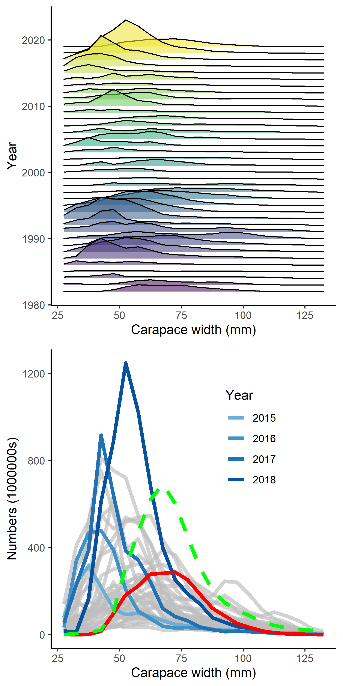

```{r, include=FALSE}

knitr::opts_chunk$set(echo=FALSE,message=FALSE,warning=FALSE)

library(plyr)
library(dplyr)
library(knitr)
library(ggplot2)
library(PBSmodelling)
library(pander)
library(coda)
library(maps)
library(lattice)
library(PBSmapping)
library(mapdata)    #some additional hires data
library(maptools)   #useful tools such as reading shapefiles
library(mapproj)
library(plotrix)

in_path<-"C:/gmacs/gmr/R/"
library(ggridges)
library(reshape2)
library(miceadds)
source.all( path=in_path, grepstring="\\.R",  print.source=TRUE, file_sep="__"  )

#source("plot.bubble.residuals.addn.R")

```


```{r,echo=F,message=FALSE,warning=F,include=FALSE}

survey_fig_N<-7
ABC_buffer  <-0.5
chosen_model<-"opilio"
chosen_ind<-1
ChosenInd<-1

#===PULL gmacs DATA AND outputs

#===============
# directory in which all of the scenario folder reside and names of the scenario folders
Scenarios   <-c("20_sq","20_sq_q","20_sq_m","20_sq_both")
ScenarioNames<-c("Status quo","Vary q","Vary M","Vary both")

#==make a list of the scenario names
##==save all of the output from the scenarios
snowad.rep<-rep(list(list()),length(Scenarios))
CatchYrN<-rep(list(list()),length(Scenarios))
SurvYrN<-rep(list(list()),length(Scenarios))
DiscYrFN<-rep(list(list()),length(Scenarios))
DiscYrMN<-rep(list(list()),length(Scenarios))
TrawlYrN<-rep(list(list()),length(Scenarios))
ObsCatchNumbers<-rep(list(list()),length(Scenarios))
ObsCatchPounds<-rep(list(list()),length(Scenarios))
RetCatchYrs<-rep(list(list()),length(Scenarios))
TotCatchYrs<-rep(list(list()),length(Scenarios))
ObsDiscF<-rep(list(list()),length(Scenarios))
ObsDiscM<-rep(list(list()),length(Scenarios))
TrawlBycatch<-rep(list(list()),length(Scenarios))
SurveyNumbers<-rep(list(list()),length(Scenarios))
SurveyYrs<-rep(list(list()),length(Scenarios))
LengthBins<-rep(list(list()),length(Scenarios))
GrowthNfem<-rep(list(list()),length(Scenarios))
GrowthNm<-rep(list(list()),length(Scenarios))
GrowthData<-rep(list(list()),length(Scenarios))

REPfileEnd<-rep(list(list()),length(Scenarios))
MgmtQuants<-rep(list(list()),length(Scenarios))

# names(snowad.rep[[ChosenInd]])
# snowad.rep[[ChosenInd]]$"Predicted probability of maturing female" 
# snowad.rep[[ChosenInd]]$"Predicted probability of maturing male" 

for(x in 1:length(Scenarios))
{
  snowad.rep[[x]]  <-readList(paste(Scenarios[x],"/R_input.txt",sep=""))

DATfile <-readLines(paste(Scenarios[x],"/2016sc.DAT",sep=""))

# length of data types
tmp<-grep("number of years of retained fishery data",DATfile)
CatchYrN[[x]] <-as.numeric(DATfile[tmp+1])
tmp<-grep("number of years of survey data",DATfile)
SurvYrN[[x]] <-as.numeric(DATfile[tmp+1])
tmp<-grep("number of years of fishery discard",DATfile)
DiscYrFN[[x]] <-as.numeric(DATfile[tmp+1])
tmp<-grep("number of years of fishery male discard",DATfile)
DiscYrMN[[x]] <-as.numeric(DATfile[tmp+1])
tmp<-grep("number of years of trawl discard",DATfile)
TrawlYrN[[x]] <-as.numeric(DATfile[tmp+1])

# observed retained catch
tmp<-grep("retained catch in numbers",DATfile)
ObsCatchNumbers[[x]]<-as.numeric(DATfile[(tmp+1):(tmp+CatchYrN[[x]])])[1:CatchYrN[[x]]]
tmp<-grep("retained catch in pounds",DATfile)
ObsCatchPounds[[x]]<-as.numeric(DATfile[(tmp+1):(tmp+CatchYrN[[x]])])[1:CatchYrN[[x]]]
tmp<-grep("years for fishery data",DATfile)
RetCatchYrs[[x]]<-as.numeric(unlist(strsplit(DATfile[(tmp+1)],split=" ")))
RetCatchYrs[[x]]<-RetCatchYrs[[x]][!is.na(RetCatchYrs[[x]])]

tmp<-grep("years when have fishery discard length data",DATfile)
TotCatchYrs[[x]]<-as.numeric(unlist(strsplit(DATfile[(tmp+1)],split=" ")))
TotCatchYrs[[x]]<-TotCatchYrs[[x]][!is.na(TotCatchYrs[[x]])]

# observed discard
tmp<-grep("Discard Catch from observer",DATfile)
ObsDiscF[[x]]<-as.numeric(DATfile[(tmp+2):(tmp+1+CatchYrN[[x]])])[1:CatchYrN[[x]]]
tmp<-grep("discard catch males",DATfile)
ObsDiscM[[x]]<-as.numeric(DATfile[(tmp+1):(tmp+CatchYrN[[x]])])[1:CatchYrN[[x]]]

# observed trawl
tmp<-grep(" bycatch numbers by geartype",DATfile)
TrawlBycatch[[x]]<-as.numeric(DATfile[(tmp+2):(tmp+1+CatchYrN[[x]])])[1:CatchYrN[[x]]]

# survey numbers
tmp<-grep("survey numbers by year",DATfile)
SurveyNumbers[[x]]<-as.numeric(DATfile[(tmp+1):(tmp+SurvYrN[[x]])])
tmp<-grep("years for survey data",DATfile)
SurveyYrs[[x]]<-na.omit(as.numeric(unlist(strsplit(DATfile[(tmp+1)],split=" "))))

tmp<-grep("length bins",DATfile)[[5]]
LengthBins[[x]]<-as.numeric(unlist(strsplit(DATfile[(tmp+1)],split=" ")))
LengthBins[[x]]<-LengthBins[[x]][!is.na(LengthBins[[x]])]

tmp       <-grep("growth data female",DATfile)
GrowthNfem[[x]]<-as.numeric(DATfile[(tmp+1)])
tmp1      <-grep("growth data male",DATfile)
GrowthNm[[x]]  <-as.numeric(DATfile[(tmp1+1)])
GrowthData[[x]]<-matrix(NA,ncol=4,nrow=max(GrowthNm[[x]],GrowthNfem[[x]]))

GrowthData[[x]][1:GrowthNfem[[x]],1] <-na.omit(as.numeric(unlist(strsplit(DATfile[(tmp+2)],split="\t"))))
GrowthData[[x]][1:GrowthNfem[[x]],2] <-na.omit(as.numeric(unlist(strsplit(DATfile[(tmp+3)],split="\t"))))

GrowthData[[x]][1:GrowthNm[[x]],3]  <-na.omit(as.numeric(unlist(strsplit(DATfile[(tmp1+2)],split="\t"))))
GrowthData[[x]][1:GrowthNm[[x]],4] <-na.omit(as.numeric(unlist(strsplit(DATfile[(tmp1+3)],split="\t"))))

#==pulling MLEs for management quantities
for(x in 1:length(Scenarios))
{
  REPfileEnd[[x]]       <-readLines(paste(Scenarios[x],"/2016sc.REP",sep=""))
  MgmtQuants[[x]]       <-as.numeric(unlist(strsplit(as.character(REPfileEnd[[x]][1]),split=" ")))
  MgmtQuants[[x]]$Status<-as.numeric(MgmtQuants[[x]][5])/as.numeric(MgmtQuants[[x]][2])
  names(MgmtQuants[[x]])<-c("F","BMSY","Surv_MMB","Fish_MMB","Mate_MMB","F35","FOFL","OFL","Status")
  }
}


#==MLE stuff
#==set up storage
  mle_B35<-list()
  mle_F35<-list()
  mle_FOFL<-list()
  mle_OFL<-list()
  mle_MMB<-list()
  mle_projMMB<-list()
  mle_ABC<-list()
  mle_Status<-list()
  mle_Status2<-list()
  mle_allMMB<-list()

  #==CHECK THIS  
for(x in 1:length(Scenarios))
{  
 REPfile <-readLines(paste(Scenarios[x],"/2016sc.REP",sep=""))
 temp <-as.numeric(unlist(strsplit(REPfile[1],split=" ")))
 temp <-temp[!is.na(temp)]
 mle_B35[[x]] <-temp[2]
 mle_F35[[x]] <-temp[6]
 mle_FOFL[[x]]<-temp[7]
 mle_OFL[[x]] <-temp[8]
 mle_MMB[[x]] <-temp[5]    
 mle_ABC[[x]]<-mle_OFL[[x]]*ABC_buffer
 mle_Status[[x]]<-mle_MMB[[x]]/mle_B35[[x]]

 mle_projMMB[[x]]<-snowad.rep[[x]]$"Mature male biomass at mating"[SurvYrN[[x]]]
 mle_allMMB[[x]]<-snowad.rep[[x]]$"Mature male biomass at mating"
 mle_Status2[[x]]<-mle_projMMB[[x]]/ mle_B35[[x]]
   
}
  
 B35<-mle_B35
 F35<-mle_F35
 FOFL<-mle_FOFL
 OFL<-mle_OFL
 MMB<-mle_MMB    
 ABC<-mle_ABC
 Status<-mle_Status 
 projMMB<-mle_projMMB
 proj_Status<-mle_Status2
 
 # organize data_2020
# repfile20<-scan("20_gmacs_3_proj_rec/mcoutSSB.REP")
# hist_ssb20<-matrix(repfile20,ncol=length(seq(1982,2019)),byrow=T)
# colnames(hist_ssb20)<-seq(1982,2019)
# 
# innames<-c("Draw","Replicate","Treatment",paste("F",seq(1,length(M[[1]]$log_fbar))),
#            "B35",paste("proj_ssb_",seq(2020,2025)))
# projfile20<-as.data.frame(matrix(scan("20_gmacs_3_proj_rec/mcoutPROJ.REP"),ncol=length(innames),byrow=TRUE))
# colnames(projfile20)<-innames
# 
# ind<-grep('ssb',colnames(projfile20))
# adj_proj20<-dplyr::filter(projfile20,Replicate==1& Treatment==3)
# proj_ssb20<-cbind(hist_ssb20,adj_proj20[,ind])
# colnames(proj_ssb20)<-seq(1982,2025)
# 
# proj_ssb_1<-proj_ssb20[1,]
# 
#  proj_ssb_19<-proj_ssb_1[colnames(proj_ssb_1)==2019]
#  proj_ssb_20<-proj_ssb_1[colnames(proj_ssb_1)==2020] 

```


Population dynamics models used to provide management advice for harvested natural resources often estimate population processes that can be mutually confounded. These processes (e.g. natural mortality (M), catchability (q), growth) are often assumed to be time-invariant, but this assumption can be difficult to meet in real populations. Not allowing for time-variation in these processes can result in retrospective patterns in estimated biomass, which can result in errors in management advice. Allowing for time-variation in these processes can also result in errors in management advice if the estimated time-variation does not reflect the true underlying variation. Here I present a population dynamics model for snow crab in the eastern Bering Sea that tests different combinations of implementation of time-variation in M and q.  The managing body for snow crab did not adopt any of the models with time-variation in M or q for management because the estimated variability in M and q was difficult to explain with any known mechanism and management advice differed by nearly an order of magnitude among models. Large differences in management advice underscores the importance of evidence-based approaches to incorporating time-variation into stock assessment models.

\newpage
# Introduction

Modeling the dynamics of populations often requires making simplifying assumptions to produce tenable models. For example, in fisheries stock assessment, population processes like natural mortality, catchability, growth, and maturity are often assumed to be time-invariant. However, this assumption has been shown to be false for some populations. For example, Wilberg et al. (2009) collated published evidence for changes in catchability for XX stocks, Stawitz et al. (2014) demonstrated considerable variabilty in growth for stocks in the Bering Sea, and Jacobsen and Essington (2018) cataloged changes in natural mortality for forage fish in European waters. The potential for non-stationarity in population processes will likely increase as climate changes globally (Szuwalski and Hollowed, 2016). 

Satisfactorily addressing the potential that other confounding processes are not driving observed changes in a stock is a key concern in convincingly estimating time-variation in stock assessment. Similar changes in the observed indices of abundance can be cause by changes in natural mortality, selectivity, growth, or catchability (e.g. Thompson, 1994). A decline in biomass in the terminal year of the time series can arise from increased natural mortality, decreased selectivity or catchability, or decreases in growth. This confounding can lead to the dilemma of 'Kill them or hide them?' when assessing stocks in which there are unexpected declines (Taylor and Methot, 2014). Data to distinguish between mortality events and changes in selectivity are often difficult to procure and, even when the data are possible to collect, often arrive after the point in time at which they are needed to establish management advice. 

Given the above issues, population dynamics models used to manage harvested natural resources often seek to strike a balance between simplicity and complexity in modeling assumptions that appropriately captures the processes important in determining sustainable harvests (e.g. natural mortality, growth, selectivity, catchability, and maturity) without overstepping the information content in the data. In general, three pieces of information are needed in harvest control rules that produce catch recommendations: biomass at the time of the next fishery, a target biomass, and a target fishing mortality. Broadly speaking, these pieces represent the current status of a fishery, the target status for a fishery, and the pathway for how to achieve the target from the current situation. Oftentimes the biomass and fishing mortality targets are based on maximum sustainable yield calculations (e.g. Schaefer, 1954) or proxies thereof (e.g Clark, 1991).

Each of these pieces of information can be influenced by the assumptions about population processes made while developing a population dynamics model. Assuming time-invariance in the population processes that influence estimates of current biomass can produce retrospective patterns and lead to ineffective management advice if those processes vary over time (REF). Assuming time-invariance in the population processes that determine the management targets for biomass and fishing mortality may be reasonable if the forcing of these processes is stationary because the targets should represent the mean state of the system. However, if the environmental forcing of these processes is non-stationary (i.e. the mean changes over time), changes in population processes result in changes in management quantities (Thorson et al. 2015) and decisions must be made about the time period used as a reference to calculate management targets (NPFMC, 2008).  

Snow crab in the eastern Bering Sea present appears to have time-variation in population processes (Murphy et al. 2020, Somerton et al. 2013) and is at least at risk of non-stationarity in some population processes (particularly those related to ice extent like recruitment; Szuwalski et al., 2020). The snow crab fishery has been managed with individual transferable quotas since 2004 and only retains large male crab with carapace width greater than 101 mm (\autoref{fish_hist}). Catches were highest in the 1990s, after which the stock biomass declined sharply and the stock was declared overfished in 1999. The National Marine Fishery Services (NMFS) summer trawl survey is a key information source in the stock assessment for snow crab and large pseudocohorts have appeared in the survey three times since 1982 (\autoref{fish_hist} & \autoref{n_at_len}). 

The most recent large pseudocohort was spawned in 2010 and recruited to the survey gear in 2015. By 2018, it was the largest pseudocohort observed in the survey data. However, in 2019, it was much smaller than it should have been given estimated growth, natural mortality, and fishing removals (\autoref{n_at_len}).  This strongly implies either time-variation in some population process and catchability or natural mortality are key suspects. However, there are few data to decisively indicate which process is varying over time. No survey was performed in 2020 as a result of the coronavirus pandemic, so the managing body was in the unprecedented position of setting the overfishing level (i.e. the level of catch beyond which overfishing would occur, used to set allowable biological catches) in a year with no survey data and in the context of a large drop in the previous year of survey data that could be attributed to changes in either natural mortality or catchability.

Here I present iterations of the assessment method used for snow crab that incorporate time-variation in natural mortality and/or catchability. I then compare the resulting fits to the data sources, the character and credibility of the estimated time-variation in q and M, and the knock-on effects in other confounded processes like maturity and recruitment. I conclude by examining the differences in management-related quantities (e.g. F~35%~ and B~35%~), summarizing the discussion the management body held concerning these models, and discussing potential paths forward.   

# Methods
The integrated size-structured model currently used (referred to here as the 'status quo' model) was developed by Turnock (2015) following Fournier and Archibald's (1982) methods, with many similarities to Methot (1990). The population dynamics in the status quo model tracks the number of crab of sex *s*, maturity state *m*, during year *y* at length *l*, N~*s,m,y,l*~. A terminal molt occurs in which crab move from an immature to a mature state, after which no further molting occurs. The mid-points of the size bins tracked in the model span from 27.5 to 132.5mm carapace width, with 5 mm size classes. Parameters estimated within the assessment include those associated with recruitment, natural mortality (subject to a fairly informative prior), fishing mortality, selectivity (fishery and survey), survey catchability, and probability of maturing.  Weight at length, discard mortality, bycatch mortality, and parameters associated with the variance in growth and proportion of recruitment allocated to size bin were estimated outside of the model or specified. Growth parameters were estimated outside of the model based measurements of pre-molt and post-molt carapace width for crab captured in the wild just prior to molting. Survey biomass indices and size composition data, directed fishery biomass and size composition data, and bycatch biomass and size composition data were fit to within the assessment. The assessment spans the years 1982 to 2020. See appendix A for a complete description of the population dynamics and visit the github repository for this paper to inspect the code. 

The output of three models are compared to the status quo: "Vary M", "Vary q", and "Vary both". Each of these models builds on the status quo model and alters the way in which natural mortality ("Vary M"), catchability ("Vary q"), or both processes ("Vary both") are modeled. "Vary M" adds a vector of deviations to the existing estimated parameters for mature natural mortality of both sexes (i.e. a 'dev_vector' in ADMB). The dev_vector estimates an additional parameter for each year included in the assessment (1982-2020) for each sex. "Vary q" estimates a catchability parameter for each year from 1989-2020 for each sex. The estimated vectors of q are bounded by 0.2 and 1.0 based information from experimental net efficiency work for Bering Sea snow crab that suggests catchability should be within this range (Somerton et al., 2013). "Vary both" combines these changes into a single model. A smoothing penalty is added to the negative log likelihood of each model in the form of the squared norm of the second difference of each vector of additionally estimated estimated parameters multiplied by a user-defined weighting factor. The weights for the smoothing penalties were chosen by trial and error, with the aim of making them as small as possible while still avoiding convergence issues.

Retrospective analyses were performed in which the terminal year of data was removed sequentially from the model fitting, then estimated management quantities (e.g. mature male biomass [MMB]) were compared between the model with the complete data set (i.e. 1982-2020) and successive 'peels' of the data to identify retrospective patterns. A retrospective pattern is a consistent directional change in assessment estimates of management quantities in a given year when additional years of data are added to an assessment. Mohn's rho (which computes the average difference between the reference case and the peels over the period of retrospective analysis; REF) was calculated for each model to quantify the retrospective patterns. 

The overfishing level (OFL) is level of catch beyond which overfishing would be deemed to occur. The OFL is one of the key pieces of management advice that arises from the assessment and serves as the starting point for specifying an 'acceptable biological catch', which constrains removals in the fishery. The OFL was calculated using proxies for biomass and fishing mortality reference points and a sloped control rule. Proxies for biomass and fishing mortality reference points were calculated using spawner-per-recruit methods (e.g. Clark, 1991). After fitting the assessment model to the data and estimating population parameters, the model was projected forward 100 years using the estimated parameters under no exploitation and constant recruitment to determine 'unfished' mature male biomass-per-recruit. For models in which time-variation was implemented, the average of the final 7 years of the process was used in projections. The bisection method was used iteratively to identify a fishing mortality that reduced the mature male biomass-per-recruit to 35% of the unfished level (i.e. F~35%~ and B~35%~). Calculations of F~*35%*~ were made under the assumption that bycatch fishing mortality was equal to the estimated average value. 

Calculated values of F~35%~ and B~35%~ were used in conjunction with a sloped control rule to adjust the proportion of F~35%~ that is applied based on the status of the population relative to B~35%~ (Amendment 24, NMFS).

\begin{equation}
 F_{OFL} =
 \begin{cases}
 Bycatch  & if \frac{MMB}{MMB_{35}} \leq 0.25 \\[3ex]
 \frac {F_{35} ( \frac {MMB}{MMB_{35}} - \alpha)}{1-\alpha}  & if 0.25 < \frac {MMB}{MMB_{35}} < 1 \\[3ex]
 F_{35} & if MMB > MMB_{35}
\end{cases}
\end{equation}

Where MMB is the projected mature male biomass in the current survey year after fishing at the F~*OFL*~, MMB~*35%*~ is the equilibrium mature male biomass at the time of mating resulting from fishing at F~*35%*~, F~*35%*~ is the fishing mortality that reduces the mature male biomass per recruit to 35% of unfished levels under constant recruitment, and $\alpha$ determines the slope of the descending limb of the harvest control rule (set to 0.1 here).  


# Results

All models produced a positive-definite Hessian and had maximum gradient components less than 0.004, except "Vary both", which had a maximum gradient component of 0.01 for one of the recruitment deviations for males (the rest were < 0.004). The smallest viable smoothing penalties tested were 1 and 10 for natural mortality and catchability (respectively) when they were the only additional time-varying process in the assessment. When both processes were allowed to vary, the smoothness penalty for natural mortality had to be increased to 15 or the model did not converge.  

### Fits to the data
Models "Vary M", "Vary q", and "Vary both" all fit the survey MMB better than the status quo model (\autoref{mmbfits}, \autoref{sm_mmbfits},  and \autoref{objfun}), particularly in recent years. The status quo model missed the confidence intervals of 5 of the last 6 years of survey MMB, but additional time-variation improved these fits. Fits to the catch data, growth data, and all size composition data sources can be seen in the supplementary materials. In general, the fits were similar across models, except for the survey size composition data, in which there are several years in which models that allowed for additional time-variation produce much better fits than models that did not. Retrospective patterns in the status quo model (Mohn's rho = 0.36) were improved substantially by allowing additional time-variation in either natural mortality or catchability (\autoref{retro_mult}). 

## Estimated population processes and derived quantities

Estimated population processes and derived quantities varied among models. Model "Vary both" produced the largest historical estimates of MMB (\autoref{predmmb}). The shapes of the estimated curve representing the probability of maturing for males were similar among models, but the magnitude of the probabilities varied, most strongly for males in the 70-90 mm carapace width range (\autoref{est_pop_proc}). 'Vary both' estimated the highest fraction of sub-industry-preferred size (i.e. <101 mm carapace width) crab maturing. Trajectories of estimated fishing mortality were similar across models, but variability within years existed due to differing estimates of population size (\autoref{est_pop_proc}), which is an important determinant of F~35%~. Patterns in estimated recruitment were similar for all models, but the relative magnitudes varied (\autoref{est_pop_proc}). 

Estimated natural mortality across models varied widely (\autoref{vary_nat_m_q}). Both model 'Vary both' and 'Vary M' estimated much higher natural mortality in recent years compared to historical estimates, but estimates from 'Vary both' increased very sharply starting in 2017 and ended with estimates in 2020 nearly double that of 'Vary M'. Estimates of mean natural mortality were smaller for models in which natural mortality was allowed to vary over time than for those in which natural mortality was constant over time. All models estimated lower catchability in survey era 1 (1982-1988) relative to era 2 (1989-present) for males. The shapes of the NMFS selectivity curves were similar among all models; the largest changes were seen in the catchability coefficient (see supplementary figures). Models in which catchability was time-varying estimated average catchabilities similar to the BSFRF implied catchability. However, the variability in estimated catchability for these models was large, with estimated values ranging from ~0.2 to ~1 (\autoref{vary_nat_m_q}). 

Differences in estimated population processes and fits to the data resulted in large differences in management advice (\autoref{stepchange}). The terminal year of estimated mature male biomass varied from 43,290 t to 133,510 t, with models estimating time-varying natural mortality returning much lower mature male biomass than those that did not. The corresponding target biomasses (B~35%~) were also much lower for models incorporating time-varying natural mortality because the projections used to calculate B~35%~ are based on the terminal years of estimated natural mortality, which were quite high (\autoref{vary_nat_m_q}). An additional effect of increases in estimated natural mortality (and changes in the probability of terminally molting; \autoref{est_pop_proc}) were large increases in F~35%~. In spite of large differences in the estimated MMB, the management advice from 'Vary q' was only 10% more than 'Vary M' were only 10% different (77.08 vs. 70.88 kt). This similarity in OFLs is a function of the large F~35%~ and small B~35%~ from 'Vary M' relative to 'Vary q'. However, if both processes were allowed to vary in the assessment ('Vary both'), the calculated OFL was 81% smaller than the when only one process was allowed to vary. Furthermore, if the smoothness penalty used for 'Vary both' was used in 'Vary M', the calculated OFLs were similar, suggesting relatively unstable estimation of time-varying M.


# Discussion
Time-variation in population processes appears to be an issue for snow crab, but data to inform changes in population processes over time are lacking. Allowing M or q to vary over time within the assessment lead to improved fits to the data and reductions in retrospective patterns, but the management advice differed by almost an order of magnitude. Further, estimates of time-varying natural mortality among assessment variants and other published models fit to the same data (Murphy et al. 2019) were quite different in character (\autoref{vary_nat_m_q}). Ultimately, the Crab Plan Team, which is the first level of peer review for the assessments used for crab in the Bering Sea, chose not to endorse models that allowed time-varying q or M for use in management because the estimates of q and M varied more drastically than seemed reasonable and there was no clear mechanism to support the variability.

Improvements in fit and reductions in retrospective patterns with additional model flexibility is an expected outcome and is not unique to either snow crab or size-structured models. Szuwalski et al. (2019) demonstrated a similar outcome in a simulation study based on a cod-like life history with age-structured assessment models. Retrospective patterns were induced by simulating data with time-variation in growth, selectivity, or natural mortality and fitting assessment models that did not model time-variation in those processes. Next, assessment models that allowed either growth, selectivity, or natural mortality were fit to the data. Implementing any of these time-varying processes reduced the retrospective pattern, but the resulting management advice resulted in over- or under-exploiting the stock if the incorrect process was allowed to vary. One of the main recommendations of the paper was that an understanding of what process is time-varying is recommended before implementation of time-variation in integrated assessments.

The confounding of these processes is a central challenge in assessment (REF). However, if processes are stationary and models are appropriately specified, on average, the estimate and derived quantities used in management should reflect the underlying population. Still, even if on average the quantities used in management are not in error, large deviations in a given process in the terminal year of available data for assessment can be present problems for management. Following noise instead of signal.

This is a particularly insidious problem when changes in population processes occur in the terminal year of available data because the information about 'what happened' can be gleaned when the problem year is put in context of the years before and after it. If the population appears to decline, but then reappears in the next year, changes in selectivity/catchability 

Retrospective patterns and the resulting incorrect management advice will likely be an increasingly prevalent problem as populations respond to a changing environment if appropriate ways of incorporating time-variation into assessment cannot be found. changes in distribution (Pinksy), changes in productivity (Szuwalski), changes in growth (REF), change in M (REf). Reference points are an even harder question in a changing environment. Collie's paper on strategies?

This is not a problem we can model our way out of with the currently available data. We need more data to directly inform time-variation in these processes. Time-varying M like ICES?


We know it is hard to estimate time variation in many processes with the data often available for population dynamics modeling. (Johnson et al. 2014)

Generally, fitting multiple data sources in an integrated model is preferable when data are available to parameterize the model such that variation in the modeled processes are informed sufficiently enough to be estimated. Fitting multiple data sources at once allows the uncertainty in each process to be propagated appropriately, but also requires that the model is appropriately structured to make inference about population processes. This can be difficult if processes are confounded (like growth, natural mortality, and catchability).  If confounded processes are also varying over time, estimating this variation can be difficult (e.g. Johnson et al., 2014).

It is often thought that estimates of population processes can be improved by fitting multiple data sources because the information content in multiple data sources can corroborate and clarify the role of different processes in the population dynamics. This works well if the model is well-specified, but if it is not, estimating within an integrated assessment could result in incorrect inference about population processes. 


# Acknowledgments
I'd like to thank Jack Turnock for passing the status quo code down to me upon his retirement. The github repository for this paper can be found at: https://github.com/szuwalski/snow_time_m

\newpage

# References

Clark, W.G. 1991. Groundfish exploitation rates based on life history parameters. Can. J. fish. Aquat. Sci. 48: 734-750.

Fonseca, D. B., B. Sainte-Marie, and F. Hazel. 2008. Longevity and change in shell condition of adult male snow crab Chionoecetes opilio inferred from dactyl wear and mark-recapture data. Transactions of the American Fisheries Society 137:1029-1043.

Fournier, D.A. and C.P. Archibald. 1982.  A general theory for analyzing catch-at-age data. Can.J.Fish.Aquat.Sci. 39:1195-1207.

Jacobsen, N.S., Essington, T.E. 2018. Natural mortality augments population fluctuations of forage fish. Fish and Fisheries. 19(5): 791-797.

Methot, R. D.  1990.  Synthesis model: An adaptable framework for analysis of diverse stock assessment data.  Int. N. Pac. Fish. Comm. Bull. 50:259-277.

Murphy, J.T., Rugolo, L.J., Turnock, B.J. 2018. Estimation of annual, time-varying natural mortality and survival for Eastern Bering Sea snow crab with state-space population models. Fisheries Research. 205: 122-131.

Nevissi, A.E., J.M. Orensanz, A.J.Paul, and D.A. Armstrong. 1995.  Radiometric Estimation of shell age in Tanner Crab, Chionoecetes opilio and C. bairdi, from the eastern Bering Sea, and its use to interpret indices of shell age/condition.  Presented at the International symposium on biology, management and economics of crabs from high latitude habitats October 11-13, 1995, Anchorage, Alaska.

NPFMC (North Pacific Fishery Management Council).  2007.  Environmental Assessment for Amendment 24.  Overfishing definitions for Bering Sea and Aleutian Islands King and Tanner crab stocks.  North Pacific Fishery Management Council,Anchorage, AK, USA..

Otto, R.S. 1998.  Assessment of the eastern Bering Sea snow crab, Chionoecetes opilio, stock under the terminal molting hypothesis.  In Proceedings of the North Pacific Symposium on Invertebrate Stock Assessment and Management.  Edited by G.S. Jamieson and A. Campbell. Can. Spec. Publ. Fish. Aquat. Sci. 125.  pp. 109-124.

Paul, A.J., J.M. Paul and W.E. Donaldson.  1995.  Shell condition and breeding success in Tanner crabs.  Journal of  Crustacean Biology 15: 476-480.

Sainte-Marie, B., J. Sevigny and M. Carpentier.  2002.  Interannual variability of sperm reserves and fecundity of primiparous females of the snow crab (Chionoecetes opilio) in relation to sex ratio.  Can.J.Fish.Aquat.Sci. 59:1932-1940. 

Schaefer, M.B. 1954. Some aspects of the dynamics of populations important to the management of commercial marine fisheries. Bulletin of the Inter-American Tropical Tuna Commission. 1(2): 27-56.

Somerton, D.A. Weinberg, K.L., Goodman, S.E. 2013. Catchability of snow crab by the eastern Bering Sea bottom trawl survey estimated using a catch comparison experiment.  Can.J.Fish.Aquat.Sci. 70: 1699-1708.

Stawitz, C.C., Haltuch, M.A., Johnson, K.F. 2019. How does growth misspecficiation affect management advice derived from an integrated fisheries stock assessment model?" Fisheres Research. 213: 12-21.

Szuwalski, C.S. and Hollowed, A.B. 2016. Climate change and non-stationary population processes in fisheries management. ICES j. Mar Sci. 73(5): 1297-1305.

Szuwalski, C.S., Ianelli, J.N., Punt, A.E. 2019. Reducing retrospective patterns in stock assessment and impacts on management performance. ICES Journal of Marine Science. 75(2): 596-609.

Taylor, I.G., Methot, R.D. 2013. Hiding or dead? A computationall efficient model of selective fisheries mortality. fisheries research. 142: 75-85.

Thomspon, G.G. 1994. Confounding of gear selectivity and natural mortality rate in cases where the former is a nonmonotone function of age. CJFAS. 51(12): 

Thorson, J.T., Monnahan, C.C., Cope, J.M. 2015. The potential impact of time-variation in vital rates on fisheries management argets for marine fishes. 169: 8-17.

Wilberg, M.J., Thorson, J.T., Linton, B.C., Berkson, J. 2009. Incorporating time-varying catchability into population dynamics stock assessment models. Reviews in Fishery Science. 18(1): 7-24.


\newpage

Appendix A: Population dynamics model description

Numbers of sex *s* of shell condition *v* and maturity state *m* at length *l* in the initial year of the assessment, N~*s,v,m,y=1,l*~, were calculated from an estimated vector of numbers at length *l* by sex *s* and maturity state *m* for males, $\lambda_{s,m,l}$ and numbers at length *l* by sex *s* and shell condition *v* for females (i.e. 2 vectors for each sex were estimated). Estimated vectors of initial numbers at length by maturity for females were calculated by splitting the estimated vectors at length by the observed proportion mature in the first year of the survey.  
 
\begin{equation} N_{s,v,m,y=1,l} = 
  \begin{cases}
  \Omega_{s,l}^{obs} \lambda_{s,1,l} & \text{if v = new; m = mat, s = fem} \\[2ex]
  1-\Omega_{s,l}^{obs} \lambda_{s,1,l} & \text{if v = new; m = imat, s = fem} \\[2ex]
  \lambda_{s,2,l} & \text{if v = old; m = mat, s = fem} \\[2ex]
  0 & \text{if v = old; m = imat} 
  \end{cases}
  \end{equation}

Initial numbers at length for males were all assumed to be new shell. 

\begin{equation} N_{s,v,m,y=1,l} = 
  \begin{cases}
   \lambda_{s,1,l} & \text{if v = new; m = mat, s = male} \\[2ex]
   \lambda_{s,2,l} & \text{if v = new; m = imat, s = male} \\[2ex]
  0 & \text{if v = old; m = mat, s = male} \\[2ex]
  0 & \text{if v = old; m = imat, s = male} 
  \end{cases}
  \end{equation}

The dynamics after the initial year were described by:

  \begin{equation} N_{s,v,m,y+1,l} = 
  \begin{cases}
  \Omega_{s,l}  \kappa_{s,l'} Q_{s,imat,y,l'} X_{s,l',l} & \text{if v = new; m = mat} \\[2ex] 
  1-\Omega_{s,l} \kappa_{s,l'} Q_{s,imat,y,l'} X_{s,l',l} + Rec^\epsilon_y Pr_{l} & \text{if v = new; m = imat} \\[2ex]
  Q_{s,mat,y,l'} & \text{if v = old; m = mat} \\[2ex]
  (1-\kappa_{s,l'}) Q_{s,imat,y,l'} & \text{if v = old; m = imat} 
  \end{cases}
  \end{equation}

Where $\Omega_{s,l}$ was the probability of maturing at length *l* for sex *s* (a freely estimated vector for both males and females constrained by penalties on smoothness), $\kappa_{s,l'}$ was the probability of molting for an immature crab of sex *s* at length *l'* (set to 1 for all immature crab),  and X~*s,l,l'*~ was the size transition matrix describing the probability of transitioning from size *l'* to size *l* for sex *s*. Q~*s,m,y,l'*~ was the number of crab of sex *s*, maturity state *m*, and length *l'* surviving natural and fishing mortality during year *y*:

 \begin{equation}
  Q_{s,m,y,l} = \sum_v N_{s,v,m,y,l}e^{Z_{s,v,m,y,l}} 
 \end{equation}
 
 Where N~*s,v,m,y,l*~ represented the numbers, *N*, of sex *s* during year *y* of shell condition *v* and maturity state *m* at length *l*. Z~*s,v,m,y,l*~ represented the total mortality experienced by the population and consisted of the sum of instantaneous rates of natural mortality by sex and maturity state, M~*s,m*~, and fishing mortality, F~*s,f,y,l*~ from each fishery. Each fishing mortality was subject to selectivity by length *l*, which varied between sexes *s* and fisheries *f* (and by year *y* if specified) . M~*s,m*~ was specified in the model and a multiplier $\gamma_{natM,m}$ was estimated subject to constraints (see this formulation effectively specified a mean and standard deviation for a prior distribution for M).
 
 \begin{equation} Z_{s,v,m,y,l} = \gamma_{natM,m} M_{s,m} + \sum_f S_{s,f,y,l} F_{s,f,y,l} \end{equation}
 
Selectivities in the directed and bycatch fisheries were estimated logistic functions of size.  Different selectivity parameters were estimated for females and males in the directed fisheries (S~*fem,dir,l*~ and S~*male,dir,l*~, respectively), a single selectivity for both sexes was estimated for bycatch in the groundfish trawl fishery (S~*trawl,l*~), and a retention selectivity was estimated for the directed fishery for males (R~*dir,l*~; all females were discarded).
 
  \begin{align}
  S_{male,dir,l} = & \frac {1}{1+e^{-S_{slope,m,d}(L_{l}-S_{50,m,d}}}) \\
  S_{fem,dir,l} = & \frac {1}{1+e^{-S_{slope,f,d}(L_{l}-S_{50,f,d}}}) \\
  S_{trawl,l} = & \frac {1}{1+e^{-S_{slope,t}(L_{l}-S_{50,t}}}) \\
  R_{dir,l} = & \frac {1}{1+e^{-S_{slope,m,d}(L_{l}-S_{50,m,d}}})
  \end{align}

Where S~*slope,s,f*~ was the slope of the logistic curve for sex *s* in fishery *f* and S~*50,s,f*~ was the length at 50% selection for sex *s* in fishery *f*.  Catches for all fisheries were modeled as pulse fisheries in which all catch was removed instantaneously (i.e. no natural mortality occurred during the fishery). Catch in fishery *f* during year *y* was calculated as the fraction of the total fishing mortality, F~*s,f,y,l*~, applied to a given sex *s* in a fishery *f* times the biomass removed by all fisheries for that sex.

 \begin{align}
 C_{male,dir,y}  = & \sum_{l} \sum_{v} \sum_{m} w_{male,l} \frac {R_l F_{male,dir,y,l}}{F_{male,dir,y,l} + F_{trawl,y,l}} N_{male,v,m,y,l} e^{-\delta_y M_{s,m}} (1-e^{-(F_{male,dir,y,l}+F_{trawl,y,l})}) \\
 C_{male,tot,y}  = & \sum_{l} \sum_{v} \sum_{m} w_{male,l} \frac {F_{male,dir,y,l}}{F_{male,dir,y,l} + F_{trawl,y,l}} N_{male,v,m,y,l} e^{-\delta_y M_{s,m}} (1-e^{-(F_{male,dir,y,l}+F_{trawl,y,l})}) \\
 C_{fem,dir,y}   = & \sum_{l} \sum_{v} \sum_{m} w_{fem,l} \frac {F_{fem,dir,y,l}}{F_{fem,dir,y,l} + F_{trawl,y,l}} N_{fem,v,m,y,l} e^{-\delta_y M_{s,m}} (1-e^{-(F_{fem,dir,y,l}+F_{trawl,y,l})})  \\
 C_{m+f,trawl,y}  = & \sum_{s} \sum_{l} \sum_{v} \sum_{m} w_{s,l} N_{s,v,m,y,l} e^{-\delta_y M_{s,m}} (1-e^{-(F_{trawl,y,l})})
 \end{align}
 
Where $\delta_y$ was the mid point of the fishery (all fisheries were assumed to occur concurrently and the midpoint was based on the directed fishery, which accounts for the vast majority of the fishing mortality) and w~*s,l*~ was the weight at length *l* for sex *s*. Trawl data and discard data were entered into the model with an assumed mortality of 80% and 30%, respectively.  Fully-selected fishing mortality parameters for fishery *f* were estimated as a logged average over a given time period ($F^{log}_{avg}$) with yearly deviations around that mean ($F^{log}_{dev,y}$).

\begin{equation}
 F_{f,y} = e^{(F^{log}_{avg,f}+F^{log}_{dev,f,y})}
\end{equation}

Selectivity for the survey was estimated for 2 eras in the base model: 1982-1988 and 1989-present. Selectivity was assumed to be logistic and separate parameters representing the length at which selection probability equal 50% and 95% (s~*50,s,e*~ and s~*95,s,e*~, respectively) were estimated for males and females in the third era (1989-present). Separate catchability coefficients (q~*s,e*~) were estimated for males and females in all eras.

  \begin{equation}
  S_{surv,s,l,e} =  \frac {q_{s,e}}{1+e^{-log(19)\frac{L_{l}-s_{50,s,e}}{s_{95,s,e}-s_{50,s,e}}}}) \\
  \end{equation}

Survey selectivity was informed by experimental surveys during the years 2009 and 2010. A portion of the NMFS summer survey tows were accompanied by an industry vessel using nephrops trawls with an assumed selectivity of 1 for all size classes. To represent the proportion of the population covered by the experiment, a vector was freely estimated for males, $S^{free}_{y}$ (subject to a scaling parameter), and a logistic curve was estimated for females. 

\begin{equation} S_{ind,s,l,y} =
 \begin{cases}
  \frac {q_{ind,s,y}}{1+e^{-log(19)\frac{L_{l}-s_{50,s,y}}{s_{95,s,y}-s_{50,s,y}}}}) & \text{if s = female} \\[2ex]
   q_{ind,s,y}S^{free}_{y} & \text{if s = male}
  \end{cases}
 \end{equation}

Based on this logic, after identifying the fraction of the crab at length covered by the experimental surveys, the length frequencies of the NMFS data collected simultaneously with the experimental trawls can be calculated by multiplying the numbers at length 'available' to the experimental trawls by the overall survey selectivity, S~*surv,s,l,y*~. The predicted numbers at length for the NMFS and industry data from the selectivity experiment were calculated by multiplying the respective selectivities by the survey numbers at length.

  \begin{equation}
  S_{nmfs,s,l,y} =  S_{ind,s,l,y}  S_{surv,s,l,y} 
  \end{equation}

Mature male and female biomass (MMB and FMB, respectively) were fitted in the objective function and were the product of mature numbers at length during year *y* and the weight at length, w~*s,l*~:

  \begin{align}
  MMB_{y} = & \sum_{l,v} w_{male,l} N_{male,v,mat,y,l} \\
  FMB_{y} = & \sum_{l,v} w_{fem,l} N_{fem,v,mat,y,l} \\
  w_{s,l} = & \alpha_{wt,s}L_{l}^{\beta_{wt,s}}
  \end{align}

Mature biomass can be calculated for different time through out the year, in which case the numbers at length are decremented by the estimated natural mortality. Parameters $\alpha_{wt,s}$ and $\beta_{wt,s}$ were estimated outside of the assessment model and specified in the control file.

Molting and growth occur before the survey.  Immature crab were assumed to molt every year with an estimated probability of molting to maturity based on length *l* (in all the scenarios presented here, the probability of molting was 1 for all immature animals). For crab that do molt, the growth increment within the size-transition matrix, X~*s,l,l'*~, was based on a piece-wise linear relationship between predicted pre- and post-molt length, ($\hat{L}^{pred}_{s,l}$ and $\hat{L}^{post}_{s,l}$, respectively) and the variability around that relationship was characterized by a discretized and renormalized gamma function, Y~*s,l,l'*~.

 \begin{equation} X_{s,l,l'} = \frac{Y_{s,l,l'}}{ \sum_{l'} Y_{s,l,l'}}\end{equation}

 \begin{equation} Y_{s,l,l'} = (\Delta_{l,l'})^{\frac {\hat{L_{s,l}}-(\bar{L}_{l}-2.5)}{ \beta_{s}}} \end{equation}

 \begin{equation}
  \hat{L}^{post,1}_{s,l} = \alpha_{s} + \beta_{s,1}L_{l}
 \end{equation}
 \begin{equation}
  \hat{L}^{post,2}_{s,l} = \alpha_{s} + \delta_{s}(\beta_{s,1}-\beta_{s,2}) + \beta_{s,2}L_{l}
 \end{equation}

\begin{equation}
 \hat{L}^{post}_{s,l} = \hat{L}^{post,1}_{s,l} (1 - \Phi (\frac {L_{l} - \delta_{a,x}}{stgr})) + \hat{L}^{post,2}_{s,l} (\Phi (\frac {L_{l} - \delta_{a,x}}{stgr}))
\end{equation}

\begin{equation} \Delta_{l,l'} = \bar{L}_{l'} + 2.5 - L_{l} \end{equation}


 $\hat{L}^{post,1}_{s,l}$ and $\hat{L}^{post,2}_{s,l}$ were predicted post-molt lengths from each piece of the piece-wise relationship, and $\Phi$() was a cumulative normal distribution in which $\delta_{a,x}$ was an estimated change point.  The model in which linear growth was estimated removed equations 26 and 27 from the model.
 
 An average recruitment for the assessment period (1982-present) and yearly deviations around this average were estimated within the assessment for models in which only a single vector of recruitment deviations was estimated.  The sex ratio of recruitment was assumed to be 50/50 male to female.  Each year's estimated recruitment was allocated to length bins based on a discretized and renormalized gamma function with parameters specified in the control file.
 
 \begin{equation} Rec_{y} = e^{(Rec_{avg} + Rec_{dev,y})} \end{equation}
 \begin{equation} Pr_l = \frac {(\Delta_{1,l})^{\alpha_{rec}/ \beta_{rec}}e^{-\Delta_{1,l'}/ \beta_{rec}}}{\sum_{l'} (\Delta_{1,l'})^{\alpha_{rec}/ \beta_{rec}}e^{(-\Delta_{1,l'}/\beta_{rec})}} \end{equation}
 
For models in which separate vectors of recruitment deviations were estimated for males and females, a separate average recruitment was also estimated (in log space).  Each vector of deviations was also subject to a smoothing penalty, but were not linked directly in any way (e.g. priors on the ratio of estimated male to female average recruitment).

Three general types of likelihood components were used to fit to the available data. Multinomial likelihoods were used for size composition data, log-normal likelihoods were used for indices of abundance data, and normal likelihoods were used for catch data, growth data, priors, and penalties. Multinomial likelihoods were implemented in the form:

\begin{equation} L_{x} = \lambda_{x} \sum_{y} N^{eff}_{x,y} \sum_{l} p^{obs}_{x,y,l} ln( \hat {p}_{x,y,l}/p^{obs}_{x,y,l})
\end{equation}

L~*x*~ was the likelihood associated with data component x, where $\lambda_{x}$ represented an optional additional weighting factor for the likelihood, $N^{eff}_{x,y}$ was the effective sample sizes for the likelihood, $p^{obs}_{x,y,l}$ was the observed proportion in size bin *l* during year *y* for data component *x*, and $\hat {p}_{x,y,l}$ was the predicted proportion in size bin *l* during year *y* for data component *x*.  

Log normal likelihoods were implemented in the form:

\begin{equation} L_{x} = \lambda_{x} \sum_{y} \frac {(ln(\hat{I}_{x,y}) - ln(I_{x,y}))^2}{2(ln(CV_{x,y}^2 + 1))}
\end{equation}

$L_{x}$ was the contribution to the objective function of data component *x*, $\lambda_{x}$ was any additional weighting applied to the component, $\hat{I}_{x,y}$ was the predicted value of quantity *I* from data component *x* during year *y*, I~*x,y*~ was the observed value of quantity *I* from data component *x* during year *y* and CV~*x,y*~ was the coefficient of variation for data component *x* during year *y*.   

Normal likelihoods were implemented in the form:

\begin{equation} L_{x} = \lambda_{x} \sum_{y}  (\hat{I}_{x,y} - I_{x,y})^2
\end{equation}

$L_{x}$ was the contribution to the objective function of data component *x*, $\lambda_{x}$ was represents the weight applied to the data component (and can be translated to a standard deviation), $\hat{I}_{x,y}$ was the predicted value of quantity *I* from data component *x* during year *y*, I~*x,y*~ was the observed value of quantity *I* from data component *x* during year *y*. 

Smoothing penalties were also placed on some estimated vectors of parameters in the form of normal likelihoods on the second differences of the vector with a user-specified weight. 

\newpage


```{r,echo=FALSE,warning=FALSE,message=F}

LikeNames<-read.csv(paste("LikelihoodComponentNames.txt",sep=""),header=F)

OutLikes<-rep(list(list()),length(Scenarios))
for(x in 1:length(Scenarios))
 OutLikes[[x]]<-readLines(paste(Scenarios[x],"/2016sc.REP",sep=""))[2]

# format all the above into a tabular format
tmpMat<-matrix(ncol=length(Scenarios)+1,nrow=nrow(LikeNames))

for(x in 1:length(Scenarios))
  tmpMat[,1+x]<-round(as.numeric(unlist(strsplit(OutLikes[[x]],split=" ")))[2:(nrow(tmpMat)+1)],2)

LikeForm<-read.csv(paste("Likelihood components and weightings.csv",sep=""),header=T)

PlotTab<- data.frame(tmpMat)
PlotTab[,1]<-LikeForm[,2]
colnames(PlotTab)<- c("Likelihood component",ScenarioNames)
## break apart catch and survey numbers
## add cvs for survey

rownames(PlotTab)<- NULL

AddTot<-c("Total",apply(PlotTab[,2:ncol(PlotTab)],2,sum))
#PlotTab[,3:7]<-PlotTab[,2]-PlotTab[,3:7]
PlotTab<-rbind(PlotTab,AddTot)

# levels(PlotTab[,1])[31]<-"Total"
# PlotTab[31,1]<-as.factor("Total")

pander(PlotTab,split.cells=c(6,rep(6,length(Scenarios))),split.table=Inf,justify=c("left",rep("center",length(Scenarios))),caption="\\label{objfun}Contribution to the objective function by individual likelihood component by modeling scenario. Values in columns after Model 0 are the likelihood contribution of Model 0 minus the likelihood contribution of the model in the column.  Positive values represent improvements in fit. Note that some of the model scenarios involve changing the weightings of data sources which invalidate the comparison of likelihoods for a data source among models.")

```


\newpage

```{r,echo=FALSE,warning=FALSE,message=F}


PlotTab<- data.frame(Model=ScenarioNames,
                     MMB=rep(0,length(ScenarioNames)),
                     B35=rep(0,length(ScenarioNames)),
                     F35=rep(0,length(ScenarioNames)),
                     FOFL=rep(0,length(ScenarioNames)),
                     OFL=rep(0,length(ScenarioNames)),
                     M=rep(0,length(ScenarioNames)),
                     avg_rec=rep(0,length(ScenarioNames)),
                     Status=rep(0,length(ScenarioNames)))
                     
for(x in 1:length(snowad.rep))
{
   PlotTab$MMB[x]<-MMB[[x]]
   PlotTab$B35[x]<-B35[[x]]
   PlotTab$F35[x]<-F35[[x]]
   PlotTab$FOFL[x]<-FOFL[[x]]
   PlotTab$OFL[x]<-OFL[[x]]
   PlotTab$Status[x]<-Status[[x]]
   PlotTab$M[x]<-round(mean(snowad.rep[[x]]$"atural mortality mature"[2]),2)
   if(length(snowad.rep[[x]]$"atural mortality mature")>2)
   PlotTab$M[x]<-round(mean(snowad.rep[[x]]$"atural mortality mature"[2,1:SurvYrN[[x]]]),2)
   PlotTab$avg_rec[x]<-round(mean(snowad.rep[[x]]$"estimated number of recruits male"/10000),2)
}


#grepl("20",as.character(PlotTab$Model))

rownames(PlotTab)<- NULL
PlotTab[,c(2:6)]<-round(PlotTab[,c(2:6)],2)
kable(PlotTab[,c(1:8)],split.cells=c(25,rep(7,5)),justify=c("left",rep("center",5)),caption="\\label{stepchange}Changes in management quantities for each scenario considered. Reported management quantities are derived from maximum likelihood estimates. Reported natural mortality is for mature males and average recruitment is for males.")


```

\newpage

```{r,echo=FALSE,warning=FALSE,message=F,fig.width=8.5,fig.height=5,fig.cap="\\label{fish_hist}History of the snow crab fishery in the eastern Bering Sea."}


in_col<-c("grey","grey",'grey')
kod_dat<-read.csv("data/EBSCrab_Abundance_Biomass_m.csv",header=T)
kod_dat_1<-filter(kod_dat,SEX=='MALE')
kod_dat_m_rec<-filter(kod_dat_1,SIZE_CLASS_MM<55 & SEX == 'MALE' & SIZE_CLASS_MM>50) %>%
  group_by(SURVEY_YEAR) %>%
  summarize(rec=sum(ABUNDANCE)/1000000,sd_rec=mean(BIOMASS_MT_CV))

in_lwd<-5

par(mfrow=c(3,1),mar=c(.1,.1,.3,.1),oma=c(4,7,4,4))
plot(as.numeric(unlist(snowad.rep[[1]]$"Observed survey male spawning biomass"))[1:SurvYrN[[1]]]~na.omit(SurveyYrs[[1]]),
     pch=16,ylab="Mature Male Biomass (1000 t)",
     xlab="Year",las=1,ylim=c(0,700),
     xaxt='n',bty='n')
#legend("topright",bty='n',"Survey mature male biomass",cex=1.5)
abline(v=1990,lty=1,lwd=in_lwd,col=in_col[1])
abline(v=1999,lty=1,lwd=in_lwd,col=in_col[2])
abline(v=2005,lty=1,lwd=in_lwd,col=in_col[3])
abline(v=2016,lty=1,lwd=in_lwd,col=in_col[2])
abline(v=2018,lty=1,lwd=in_lwd,col=in_col[1])
points(as.numeric(unlist(snowad.rep[[1]]$"Observed survey male spawning biomass"))[1:SurvYrN[[1]]]~na.omit(SurveyYrs[[1]]),pch=16)

for(j in 1:length(SurveyYrs[[2]]))
{
  segments(x0=SurveyYrs[[2]][j],x1=na.omit(SurveyYrs[[2]])[j],
           y0=as.numeric(unlist(snowad.rep[[2]]$"Observed survey male spawning biomass"))[j]  /   exp(1.96*sqrt(log(1+snowad.rep[[2]]$"survey CV"[2,]^2)))[j],
           y1=as.numeric(unlist(snowad.rep[[2]]$"Observed survey male spawning biomass"))[j] * exp(1.96*sqrt(log(1+snowad.rep[[2]]$"survey CV"[2,]^2)))[j])
}
mtext(side=2,"Mature biomass",line=3.85)
mtext(side=2,"(1000t)",line=2.5)
par(xpd=NA)
incex<-1.5
text(side=3,x=1990,y=800,"Highest catches",cex=incex)
text(side=3,x=1999,y=900,"Declared overfished",cex=incex)
text(side=3,x=2005,y=800,"Quotas introduced",cex=incex)
text(side=3,x=2016,y=800,"Lowest MMB",cex=incex)
text(side=3,x=2018,y=900,"Largest recruitment",cex=incex)
par(xpd=TRUE)
#==retained catch biomass

plot(snowad.rep[[2]]$"Observed retained catch biomass"~RetCatchYrs[[2]],las=1,ylab="Retained catch biomass (1000 t)", xaxt="n",ylim=c(0,175),xlim=c(1982,2019),type='l',bty='n')
mtext(side=2,"Retained catch",line=3.85)
mtext(side=2,"(1000t)",line=2.5)
#legend("topright",bty='n',"Retained catch",cex=1.5)
abline(v=1990,lty=1,lwd=in_lwd,col=in_col[1])
abline(v=1999,lty=1,lwd=in_lwd,col=in_col[2])
abline(v=2005,lty=1,lwd=in_lwd,col=in_col[3])
abline(v=2016,lty=1,lwd=in_lwd,col=in_col[2])
abline(v=2018,lty=1,lwd=in_lwd,col=in_col[1])
points(snowad.rep[[2]]$"Observed retained catch biomass"~RetCatchYrs[[2]],pch=16)

plot(data=kod_dat_m_rec,rec~SURVEY_YEAR,las=1,
     pch=16,ylim=c(0,1700),xlim=c(1982,2019),bty='n',xaxt='n')
abline(v=1990,lty=1,lwd=in_lwd,col=in_col[1])
abline(v=1999,lty=1,lwd=in_lwd,col=in_col[2])
abline(v=2005,lty=1,lwd=in_lwd,col=in_col[3])
abline(v=2016,lty=1,lwd=in_lwd,col=in_col[2])
abline(v=2018,lty=1,lwd=in_lwd,col=in_col[1])
points(data=kod_dat_m_rec,rec~SURVEY_YEAR,pch=16)
for(j in 1:length(kod_dat_m_rec$SURVEY_YEAR))
{
  segments(x0=kod_dat_m_rec$SURVEY_YEAR[j],
           x1=kod_dat_m_rec$SURVEY_YEAR[j],
           y0=kod_dat_m_rec$rec[j]  /   exp(1.96*sqrt(log(1+kod_dat_m_rec$sd_rec[j]^2))),
           y1=kod_dat_m_rec$rec[j] * exp(1.96*sqrt(log(1+kod_dat_m_rec$sd_rec[j]^2))))
}
axis(side=1,at=c(1982,1990,2000,2010,2020))
#legend("topleft",bty='n',"Observed recruits (carapace width <55mm)",cex=1.5)
mtext(side=2,"Recruitment",line=3.95)
mtext(side=2,"(billions)",line=2.75)
mtext(side=1,"Year",line=2.5)
```


\newpage


```{r,echo=FALSE,warning=FALSE,message=F,out.height="100%",fig.cap="\\label{n_at_len}Numbers at length from the NMFS summer trawl survey. Top figure shows the relative numbers at length over time in which the height of the polygone for a given year represents the number of crab observed in that size class. Bottom figure shows the same data, but overlaid. Highlighted years show the recruitment of the 2010 cohort to the survey gear in 2015 and the subsequent 'disappearance' of the cohort in 2019 (red line). Dashed green line represents the approximate expected numbers at length given estimated growth and natural mortality. "}




```

\newpage


```{r,echo=FALSE,warning=FALSE,message=F,fig.width=8.5,fig.height=7,fig.cap="\\label{mmbfits}Model fits to the observed mature biomass at survey"}
in_lwd<-2
##=======FITS TO THE DATA SOURCES=========================
#==mature male biomass==============
par(mar=c(.1,.1,.3,.1),oma=c(4,4,1,1))
layout(matrix(c(1,1,1,2,3,3,3,4),nrow=2,byrow=T))
par(mfrow=c(2,1),mar=c(.1,.1,.3,.1),oma=c(4,4,1,4))

plot(as.numeric(unlist(snowad.rep[[1]]$"Observed survey male spawning biomass"))[1:SurvYrN[[1]]]~na.omit(SurveyYrs[[1]]),
     pch=20,ylab="Mature Male Biomass (1000 t)",
     xlab="Year",las=1,ylim=c(0,700),
     xaxt='n')

for(j in 1:length(SurveyYrs[[2]]))
{
 segments(x0=SurveyYrs[[2]][j],x1=na.omit(SurveyYrs[[2]])[j],
		y0=as.numeric(unlist(snowad.rep[[2]]$"Observed survey male spawning biomass"))[j]  /   exp(1.96*sqrt(log(1+snowad.rep[[2]]$"survey CV"[2,]^2)))[j],
		y1=as.numeric(unlist(snowad.rep[[2]]$"Observed survey male spawning biomass"))[j] * exp(1.96*sqrt(log(1+snowad.rep[[2]]$"survey CV"[2,]^2)))[j])
}


for(x in 1:length(snowad.rep))
lines(as.numeric(unlist(snowad.rep[[x]]$"Predicted Male survey mature Biomass"))[1:SurvYrN[[x]]]~na.omit(SurveyYrs[[x]]),type="l",lty=x,lwd=in_lwd,col=x)

legend("topleft",bty='n',"Males")
legend("topright",bty='n',lty=seq(1,4),legend=ScenarioNames,col=seq(1,length(ScenarioNames)))

#==mature female biomass==============
plot(as.numeric(unlist(snowad.rep[[2]]$"Observed survey female spawning biomass"))[1:SurvYrN[[2]]]~na.omit(SurveyYrs[[2]]),pch=20,ylab="Mature Female Biomass (1000 t)",xlab="Year",las=1,ylim=c(0,450));


for(j in 1:length(SurveyYrs[[2]]))
{
 segments(x0=SurveyYrs[[2]][j],x1=na.omit(SurveyYrs[[2]])[j],
		y0=as.numeric(unlist(snowad.rep[[2]]$"Observed survey female spawning biomass"))[j]  /   exp(1.96*sqrt(log(1+snowad.rep[[2]]$"survey CV"[1,]^2)))[j],
		y1=as.numeric(unlist(snowad.rep[[2]]$"Observed survey female spawning biomass"))[j] * exp(1.96*sqrt(log(1+snowad.rep[[2]]$"survey CV"[1,]^2)))[j])
}

axis(side=1,las=1)

for(x in 1:length(snowad.rep))
  lines(as.numeric(unlist(snowad.rep[[x]]$"Predicted Female survey mature Biomass"))[1:SurvYrN[[x]]]~na.omit(SurveyYrs[[x]]),type="l",lty=x,lwd=in_lwd,col=x)

legend("topleft",bty='n',"Females")
mtext(side=2,outer=T,line=2.5,"Biomass (1000t)")
mtext(side=1,outer=T,line=2.5,"Year")
axis(side=1,at=c(1982,1990,2000,2010,2020))
```

\newpage

```{r,echo=FALSE,warning=FALSE,message=F,fig.width=8.5,fig.height=4.5,fig.cap="\\label{sm_mmbfits}Model fits to the observed mature biomass at survey 2009-present"}

##=======FITS TO THE DATA SOURCES=========================
#==mature male biomass==============
par(mar=c(.1,.1,.3,.1),oma=c(4,4,1,1))
layout(matrix(c(1,1,1,2,3,3,3,4),nrow=2,byrow=T))
par(mfrow=c(1,1),mar=c(.1,.1,.3,.1),oma=c(4,4,1,4))

plot(as.numeric(unlist(snowad.rep[[1]]$"Observed survey male spawning biomass"))[1:SurvYrN[[1]]]~na.omit(SurveyYrs[[1]]),
     pch=20,ylab="Mature Male Biomass (1000 t)",
     xlab="Year",las=1,ylim=c(0,300),
     xaxt='n',xlim=c(2009,2021))
axis(side=1)
for(j in 1:length(SurveyYrs[[2]]))
{
 segments(x0=SurveyYrs[[2]][j],x1=na.omit(SurveyYrs[[2]])[j],
		y0=as.numeric(unlist(snowad.rep[[2]]$"Observed survey male spawning biomass"))[j]  /   exp(1.96*sqrt(log(1+snowad.rep[[2]]$"survey CV"[2,]^2)))[j],
		y1=as.numeric(unlist(snowad.rep[[2]]$"Observed survey male spawning biomass"))[j] * exp(1.96*sqrt(log(1+snowad.rep[[2]]$"survey CV"[2,]^2)))[j])
}


for(x in 1:length(snowad.rep))
lines(as.numeric(unlist(snowad.rep[[x]]$"Predicted Male survey mature Biomass"))[1:SurvYrN[[x]]]~na.omit(SurveyYrs[[x]]),type="l",lty=x,lwd=2,col=x)
mtext(side=2,line=2.3,"MMB (1000t)")
mtext(side=1,line=2.3,"Year")
legend("topleft",bty='n',"Males")
legend("topright",bty='n',lty=seq(1,4),legend=ScenarioNames,col=seq(1,length(ScenarioNames)))

```


\newpage


```{r,echo=FALSE,warning=FALSE,message=F,out.height="100%",fig.cap="\\label{retro_mult}Retrospective patterns in mature male biomass for all models in the analysis."}

include_graphics("plots/mult_retro.png")

```

\newpage


```{r,echo=FALSE,warning=FALSE,message=F,fig.width=8,fig.height=5,fig.cap="\\label{predmmb}Model predicted mature biomass at mating time. Dotted horizontal lines are target biomasses."}
#=========================================================
#  Plot derived quantities
#=========================================================
# estimated male, female, mature male, total and effective mature biomass (indicate proxy bmsy)
inlwd<-2
par(mfrow=c(1,1),mar=c(.1,.1,.3,.1),oma=c(4,4,1,1))
plot(snowad.rep[[1]]$"Mature male biomass at mating"[1:((SurvYrN[[1]]))]~SurveyYrs[[1]][1:(length(SurveyYrs[[1]]))],type="l",ylim=c(0,700),las=1, xlim=c(min(SurveyYrs[[1]]),2019),lwd=inlwd)
for (x in 2:length(snowad.rep))
 lines(snowad.rep[[x]]$"Mature male biomass at mating"[1:((SurvYrN[[x]]))]~SurveyYrs[[x]][1:(length(SurveyYrs[[x]]))],lty=1,lwd=inlwd,col=x)
legend("topright",bty='n',lty=1,legend=ScenarioNames,col=seq(1,length(ScenarioNames)),lwd=inlwd)
mtext(side=2,"Mature biomass (1000t)",line=2.5)
mtext(side=1,line=2.5,"Year")

for(x in 1:length(snowad.rep))
abline(h=B35[[x]],col=x,lty=2)
axis(side=1,at=c(1982,1990,2000,2010,2020))


```

\newpage


```{r,echo=FALSE,warning=FALSE,message=F,fig.width=4,fig.height=9,fig.cap="\\label{est_pop_proc} Estimated probability of maturing, directed fishing mortality, and recruitment for males."}

# molting probabillities, weight at length
inlwd<-2
par(mfrow=c(3,1),mar=c(.1,.1,.3,.1),oma=c(4,4,1,1))
#DATfile
plot(snowad.rep[[1]]$"Predicted probability of maturing male"~LengthBins[[1]],type='l',ylim=c(0,1),ylab='',las=1,xlab="",lwd=2,xaxt='n')
for(x in 1:length(snowad.rep))
{
#lines(snowad.rep[[x]]$"Predicted probability of maturing female"~LengthBins[[x]], col=x,ylim=c(0,1),ylab='',las=1,xlab="",xaxt='n',lty=1,lwd=2)
lines(snowad.rep[[x]]$"Predicted probability of maturing male"~LengthBins[[x]],col=x,ylim=c(0,1),ylab='',las=1,xlab="",xaxt='n',lty=x,lwd=2)
}


legend("topleft",bty='n',lty=seq(1,4),col=seq(1,length(ScenarioNames)),legend=ScenarioNames,lwd=2)

mtext(side=2,"Probability of terminal molt",line=2.5)

plot(snowad.rep[[1]]$"estimated annual total fishing mortality"~RetCatchYrs[[1]], type="l",las=1,xaxt='n',xlim=c(min(unlist(RetCatchYrs)),max(unlist(RetCatchYrs))),ylim=c(0,5),lwd=inlwd,xaxt='n')
for(x in 1:length(snowad.rep))
lines(snowad.rep[[x]]$"estimated annual total fishing mortality"~RetCatchYrs[[x]], lwd=inlwd,lty=x,col=x)
 mtext(side=2,"Directed fishing mortality",line=2.5)
 
 plot(snowad.rep[[1]]$"estimated number of recruits male"/10000~SurveyYrs[[1]][1:(length(SurveyYrs[[1]]))],ylab="",type="l",
     las=1,xlab="",ylim=c(0,2000),col=1,lwd=2)

for(y in 1:length(snowad.rep))
  lines(snowad.rep[[y]]$"estimated number of recruits male"/10000~SurveyYrs[[y]][1:(length(SurveyYrs[[y]]))],lty=x,col=y,lwd=inlwd)
  
 legend("topleft",bty='n',legend=c('Males'))
  mtext(side=2,"Recruits (billions)",line=3)
  axis(side=1,at=c(1982,1990,2000,2010,2020))


```

\newpage

```{r,echo=FALSE,warning=FALSE,message=F,fig.width=6.5,fig.height=5,fig.cap="\\label{vary_nat_m_q}Estimated time varying natural mortality for mature males and catchability."}

murph_m<-read.csv('data/murphy_m.csv')

par(mfrow=c(2,1),mar=c(.1,.1,.1,.1),oma=c(4,4,1,1))
natM<-NULL
plot(-1000,xlim=c(min(SurveyYrs[[4]]),max(SurveyYrs[[4]])),ylim=c(0,5),las=1,xaxt='n')
for(x in 3:4) 
 lines(snowad.rep[[x]]$"atural mortality mature"[2,1:(length(SurveyYrs[[x]])+1)]~ c(SurveyYrs[[x]],2020),col=x,lty=x,lwd=2)

 
legend("top",bty='n',legend=ScenarioNames[-1],lwd=1,col=seq(1,length(ScenarioNames))[-1],lty=seq(2,4))
   legend('topleft',bty='n',lty=2,"Murphy et al.")
   lines(x=murph_m$year,y=murph_m$M,lty=2,lwd=2)

 mtext(side=2,line=2.5,"Natural mortality (yr^-1)")
 plot(-1000,xlim=c(min(SurveyYrs[[2]]),max(SurveyYrs[[2]])),ylim=c(0,1),ylab='',las=1,xlab="",lwd=2)

for(x in 1:length(snowad.rep))
{
  if(length(snowad.rep[[x]]$"selectivity survey female Era 3")>length(LengthBins[[x]]))
  {
    lines(snowad.rep[[x]]$"selectivity survey male Era 3"[,22] ~ seq(1988,max(SurveyYrs[[x]])+1),col=x,lty=x,lwd=2)
    }
}
mtext(side=2,line=2.2,"Catchability")

mtext(side=1,line=2.5,"Year")
axis(side=1,at=c(1982,1990,2000,2010,2020))
 
```


\newpage

```{r,echo=FALSE,warning=FALSE,message=F,fig.width=7,fig.height=8,fig.cap="\\label{growthfits}Model fits to the growth data. These data were fit outside of the assessment model with a linear regression and the associated parameters were specified within the assessment."}

inlwd<-1.5
flength<-rep(list(list()),length(Scenarios))
mlength<-rep(list(list()),length(Scenarios))
for(x in 1:length(Scenarios))
{
  flength[[x]]<-snowad.rep[[x]]$'Predicted mean postmolt length female'
  mlength[[x]]<-snowad.rep[[x]]$'Predicted mean postmolt length male'
}

par(mfrow=c(2,1),mar=c(.1,.1,.1,.1),oma=c(4,4,1,1))

plot(GrowthData[[2]][,2]-GrowthData[[2]][,1]~GrowthData[[2]][,1],ylim=c(0,20),xlim=c(20,90),pch=16,col='red',xaxt='n',las=2)
points(GrowthData[[1]][,2]-GrowthData[[1]][,1]~GrowthData[[1]][,1],pch=16,col='grey' )

for(x in 1:length(Scenarios))
 lines(flength[[x]]-LengthBins[[x]]~LengthBins[[x]],lty=x,lwd=inlwd,col=x)

 
legend(bty='n',"topleft","Female")

plot(GrowthData[[2]][,4]-GrowthData[[2]][,3]~GrowthData[[2]][,3],ylim=c(0,20),xlim=c(20,90),pch=16,col='red',las=1)
points(GrowthData[[1]][,4]-GrowthData[[1]][,3]~GrowthData[[1]][,3],pch=16,col='grey' )

legend(bty='n',"topleft","Male")
mtext(side=2,"Growth increment (mm)",outer=T,line=2)
mtext(side=1,"Premolt length (mm)",outer=T,line=2)
for(x in 1:length(Scenarios))
 lines(mlength[[x]]-LengthBins[[x]]~LengthBins[[x]],lty=x,lwd=inlwd,col=x)

legend("bottomright",bty='n',legend=ScenarioNames,lwd=2,col=seq(1,length(ScenarioNames)))

```


\newpage

```{r,echo=FALSE,warning=FALSE,message=F,fig.width=8,fig.height=10,fig.cap="\\label{catchfits}Model fits to catch data"}

#==pull in weights used as SD
# Read data file
CTLfile <-readLines(paste(Scenarios[1],"/2016sc.CTL",sep=""))
tmp<-grep("weight for retained catch biomass",CTLfile)
RetCatWt <-as.numeric(unlist(strsplit(CTLfile[tmp+1],split=" ")))
sdRetCat<-sqrt(1/(2*RetCatWt))

tmp<-grep("wght_total_catch ",CTLfile)
TotCatWt <-as.numeric(unlist(strsplit(CTLfile[tmp+1],split=" ")))
sdTotCat<-sqrt(1/(2*TotCatWt))

tmp<-grep("disc_catch_wght_fem ",CTLfile)
FemDiscWt <-as.numeric(unlist(strsplit(CTLfile[tmp+1],split=" ")))
sdFemDisc <-sqrt(1/(RetCatWt*FemDiscWt*2))

#==retained catch biomass
par(mfrow=c(4,1),mar=c(.1,.1,.3,.1),oma=c(4,4.5,1,1))
plot(snowad.rep[[2]]$"Observed retained catch biomass"~RetCatchYrs[[2]],las=1,ylab="Retained catch biomass (1000 t)", xaxt="n",ylim=c(0,175),xlim=c(1982,2019))

for(x in 1:length(snowad.rep))
 lines(snowad.rep[[x]]$"Predicted retained catch biomas"~RetCatchYrs[[x]],lty=x,col=x)


 
legend("topright",bty='n',pch=c(NA,1),lty=c(1,NA),legend=c("Predicted","Observed"))
legend("topleft",bty='n',"Retained")

for(j in 1:length(RetCatchYrs[[2]]))
{
 segments(x0=RetCatchYrs[[2]][j],x1=RetCatchYrs[[2]][j],
		y0=as.numeric(unlist(snowad.rep[[2]]$"Observed retained catch biomass"))[j]  +   1.96*sdRetCat,
		y1=as.numeric(unlist(snowad.rep[[2]]$"Observed retained catch biomass"))[j] - 1.96*sdRetCat)
}

#===discard female biomass
plot(snowad.rep[[2]]$"observed female discard mortality biomass"~RetCatchYrs[[2]],las=1,ylab="Female discard (1000 t)",xaxt="n",ylim=c(0,0.2),xlim=c(1982,2019))
for(x in 1:length(snowad.rep))
  lines(snowad.rep[[x]]$"predicted female discard mortality biomass"~RetCatchYrs[[x]],lty=x,col=x)
legend("topleft",bty='n',"Discard (female)")
for(j in 1:length(RetCatchYrs[[2]]))
{
 segments(x0=RetCatchYrs[[2]][j],x1=RetCatchYrs[[2]][j],
		y0=as.numeric(unlist(snowad.rep[[2]]$"observed female discard mortality biomass"))[j]  +   1.96*(sdFemDisc*(mean(as.numeric(unlist(snowad.rep[[2]]$"observed female discard mortality biomass"))))),
		y1=as.numeric(unlist(snowad.rep[[2]]$"observed female discard mortality biomass"))[j] - 1.96*sdFemDisc*(mean(as.numeric(unlist(snowad.rep[[2]]$"observed female discard mortality biomass")))))
}

#===discard male biomass
plot(snowad.rep[[2]]$"observed male discard mortality biomass"~RetCatchYrs[[2]],las=1,ylab="Female discard (1000 t)",xaxt="n",ylim=c(0,30),xlim=c(1982,2019))
for(x in 1:length(snowad.rep))
 lines(snowad.rep[[x]]$"predicted discard male catch biomass"~RetCatchYrs[[x]],lty=x,col=x)
legend("topleft",bty='n',"Discard (male)")
for(j in 1:length(RetCatchYrs[[2]]))
{
 segments(x0=RetCatchYrs[[2]][j],x1=RetCatchYrs[[2]][j],
		y0=as.numeric(unlist(snowad.rep[[2]]$"observed male discard mortality biomass"))[j]  +   1.96*sdTotCat,
		y1=as.numeric(unlist(snowad.rep[[2]]$"observed male discard mortality biomass"))[j] - 1.96*sdTotCat)
}


#===trawl catch biomass
plot(snowad.rep[[2]]$"observed trawl catch biomass"[1:CatchYrN[[2]]]~RetCatchYrs[[2]],las=1,ylab="Trawl bycatch (1000 t)",xlab="Year",ylim=c(0,5),xlim=c(1982,2019))
for(x in 1:length(snowad.rep))
  lines(snowad.rep[[x]]$"predicted trawl catch biomass"[1:CatchYrN[[x]]]~RetCatchYrs[[x]],lty=x,col=x)
legend("topleft",bty='n',"Trawl")
mtext(side=2,outer=T,line=3,"Biomass (1000 t)")
mtext(side=1,outer=T,line=2.5,"Year")
legend("topright",bty='n',lty=seq(1,length(ScenarioNames)),legend=ScenarioNames,col=seq(1,length(ScenarioNames)))
for(j in 1:length(RetCatchYrs[[2]]))
{
 segments(x0=RetCatchYrs[[2]][j],
          x1=RetCatchYrs[[2]][j],
          y0=as.numeric(unlist(snowad.rep[[2]]$"observed trawl catch biomass"))[j]  + 1.96*sdRetCat*(mean(as.numeric(unlist(snowad.rep[[2]]$"observed trawl catch biomass")))),
		y1=as.numeric(unlist(snowad.rep[[2]]$"observed trawl catch biomass"))[j] - 
		  1.96*sdRetCat*(mean(as.numeric(unlist(snowad.rep[[2]]$"observed trawl catch biomass")))))
}

```


\newpage

```{r,echo=FALSE,warning=FALSE,message=F,fig.width=8.5,fig.height=8.5,fig.cap="\\label{catchcomps}Model fits to retained catch size composition data"}

PlotLenProps<-function(obs,obs2=NA,pred,pred2=NA,inYears,xquant,chopX,chopY,pointsize=1,YaxisN,XaxisN,addRow=NA,minX=0)
{
  
 #==find input years to define size of figure
 Year1<-min(na.omit(unlist(inYears)))
 YearEnd<-max(na.omit(unlist(inYears)))
 RefYear<-seq(Year1,YearEnd)
 inRow<-ceiling(sqrt(length(RefYear)))
 incol<-ceiling(sqrt(length(RefYear)))
  if(!is.na(addRow))
  inRow<-inRow+addRow
 
 xlimBot<-min(unlist(lapply(xquant,min)))
 xlimTop<-max(unlist(lapply(xquant,max)))
 if(xlimTop>chopX)
   xlimTop<-chopX
 if(xlimBot>minX)
  xlimBot<-minX
 par(mfcol=c(inRow,incol),mar=c(0.1,.1,.1,.1),oma=c(4,4,1,1))
 for(x in 1:length(RefYear))
 {
  #==plot observations
   #==must find the observations associatd with a given year
   obsIndex<-which(unlist(lapply(lapply(inYears,match,RefYear[x]),any)))[1]
   obsYear<-which(!is.na(match(inYears[[obsIndex]],RefYear[x])))
   plot(obs[[obsIndex]][obsYear,]~xquant[[obsIndex]],pch=15,ylim=c(0,chopY),xlim=c(xlimBot,xlimTop),xaxt='n',yaxt='n',cex=pointsize)
   legend("topleft",legend=inYears[[obsIndex]][x],bty='n')
   
   if(!is.na(obs2))
   {
   obsIndex2<-which(unlist(lapply(lapply(inYears,match,RefYear[x]),any)))[1]
   obsYear<-which(!is.na(match(inYears[[obsIndex2]],RefYear[x])))
   points(obs2[[obsIndex2]][obsYear,]~xquant[[obsIndex2]],pch=16,ylim=c(0,chopY),xlim=c(xlimBot,xlimTop),xaxt='n',yaxt='n',cex=pointsize) 
   } 
     

 for(y in 1:length(inYears))
  {
   useInd<-which(!is.na(match(inYears[[y]],RefYear[x])))
  #==now plot predictions from each model, if that year exists
    if(length(useInd)>0)
     lines(pred[[y]][useInd,]~xquant[[y]],pch=16,col=y,cex=pointsize,lty=y )
   
   if(!is.na(obs2))
   {
     useInd<-which(!is.na(match(inYears[[y]],RefYear[x])))
  #==now plot predictions from each model, if that year exists
    if(length(useInd)>0)
     lines(pred2[[y]][useInd,]~xquant[[y]],pch=16,col=y,cex=pointsize,lty=y )
   }
  }
   
  }
 }


#==this sucks, butwriting a function to do this has too many moving parts....
inPred<-rep(list(list()),length(ScenarioNames))
for(x in 1:length(Scenarios))
  inPred[[x]]<-(snowad.rep[[x]]$"Predicted proportion fishery retained new male" + snowad.rep[[x]]$"Predicted proportion fishery retained old male")[,-1]


obs<-rep(list(list()))
for(x in 1:length(snowad.rep))
  obs[[x]]<-(snowad.rep[[x]]$"Observed proportion fishery retained new male" +snowad.rep[[x]]$"Observed proportion fishery retained old male")[,-1]

LengthBin_in<-LengthBins
for(x in (length(snowad.rep)+1):length(ScenarioNames))
LengthBin_in[[x]]<-LengthBin_in[[length(snowad.rep)]]

inYrs<-rep(list(list()),length(ScenarioNames))
for(x in 1:length(snowad.rep))
 inYrs[[x]]<-  SurveyYrs[[x]][1:(SurvYrN[[x]])]


 inYrs[[2]]<-inYrs[[3]]


PlotLenProps(obs = obs,
             pred =inPred,
             inYears = inYrs,
             xquant = LengthBin_in,
             chopX = 140,
             chopY = .3,
             XaxisN = 7,
             minX=85,
             YaxisN = 7,
             addRow = -1)
             plot.new()
              legend("center",pch=c(NA,16,NA),lty=c(NA,NA,1),
                    col=c(NA,1,2),legend=c("Males","Obs","Pred"),bty='n')
             plot.new()
             legend("center",lty=seq(1,length(ScenarioNames)),legend=ScenarioNames,bty='n',cex=1,col=seq(1,length(ScenarioNames)))
                          plot.new()
       
```

\newpage

```{r,echo=FALSE,warning=FALSE,message=F,fig.width=8.5,fig.height=8.5,fig.cap="\\label{totalcomps}Model fits to total catch size composition data"}

#==this sucks, butwriting a function to do this has too many moving parts....
inPred<-rep(list(list()),length(ScenarioNames))
for(x in 1:length(Scenarios))
  inPred[[x]]<-(snowad.rep[[x]]$"Predicted proportion fishery total new male" + snowad.rep[[x]]$"Predicted proportion fishery total old male")[,-1]


obs<-rep(list(list()))
for(x in 1:length(snowad.rep))
  obs[[x]]<-(snowad.rep[[x]]$"Observed proportion fishery total new male" +snowad.rep[[x]]$"Observed proportion fishery total old male")[,-1]


LengthBin_in<-LengthBins
for(x in (length(snowad.rep)+1):length(ScenarioNames))
LengthBin_in[[x]]<-LengthBin_in[[length(snowad.rep)]]

inYrs<-rep(list(list()),length(ScenarioNames))
for(x in 1:length(snowad.rep))
 inYrs[[x]]<-  SurveyYrs[[x]][11:(SurvYrN[[x]])]

 inYrs[[2]]<-inYrs[[3]]

PlotLenProps(obs = obs,
             pred =inPred,
             inYears = inYrs,
             xquant = LengthBin_in,
             chopX = 140,
             chopY = .25,
             XaxisN = 7,
             minX=85,
             YaxisN = 7,
             addRow = 0)
             plot.new()
             #  legend("center",pch=c(NA,16,NA),lty=c(NA,NA,1),
             #        col=c(NA,1,2),legend=c("Males","Obs","Pred"),bty='n')
             # plot.new()
             legend("center",lty=seq(1,length(ScenarioNames)),legend=ScenarioNames,bty='n',col=seq(1,length(ScenarioNames)))
                          plot.new()
       
```

\newpage

```{r,echo=FALSE,warning=FALSE,message=F,fig.width=8.5,fig.height=10,fig.cap="\\label{trawlcomps}Model fits to trawl catch size composition data"}

#==these are fit added together, but when split, the fit is really crummy             
inPred<-rep(list(list()),length(ScenarioNames))
for(x in 1:length(snowad.rep))
  inPred[[x]]<-snowad.rep[[x]]$"Predicted proportion trawl male" [,-1]

inPred2<-rep(list(list()),length(ScenarioNames))
for(x in 1:length(snowad.rep))
  inPred2[[x]]<-snowad.rep[[x]]$"Predicted proportion trawl female" [,-1]


obs<-rep(list(list()),length(ScenarioNames))
for(x in 1:length(snowad.rep))
  obs[[x]]<-snowad.rep[[x]]$"Observed proportion trawl male"[,-1]


obs2<-rep(list(list()),length(ScenarioNames))
for(x in 1:length(snowad.rep))
  obs2[[x]]<-snowad.rep[[x]]$"Observed proportion trawl female"[,-1]


inYrs<-rep(list(list()),length(ScenarioNames))
for(x in 1:length(snowad.rep))
 inYrs[[x]]<-  SurveyYrs[[x]][10:(SurvYrN[[x]])]


inYrs[[2]]<-inYrs[[3]]

LengthBin_in<-LengthBins
for(x in (length(snowad.rep)+1):length(ScenarioNames))
LengthBin_in[[x]]<-LengthBin_in[[length(snowad.rep)]]


make_sum_1<-function(input)
{
 tmp<-input
 tots<-sum(tmp)
 obs<-tmp/tots
 return(obs)
}
 

for(x in 1:length(obs))
{
 for(y in 1:nrow(obs[[x]]))
 { 
  obs[[x]][y,]<-make_sum_1(obs[[x]][y,])
  obs2[[x]][y,]<-make_sum_1(obs2[[x]][y,])
  inPred[[x]][y,]<-make_sum_1(inPred[[x]][y,])
   inPred2[[x]][y,]<-make_sum_1(inPred2[[x]][y,])
 }
}

PlotLenProps<-function(obs,obs2=NA,pred,pred2=NA,inYears,xquant,chopX,chopY,pointsize=1,YaxisN,XaxisN,addRow=NA,minX=0)
{
  
 #==find input years to define size of figure
 Year1<-min(na.omit(unlist(inYears)))
 YearEnd<-max(na.omit(unlist(inYears)))
 RefYear<-seq(Year1,YearEnd)
 inRow<-ceiling(sqrt(length(RefYear)))
 incol<-ceiling(sqrt(length(RefYear)))
  if(!is.na(addRow))
  inRow<-inRow+1
 
 xlimBot<-min(unlist(lapply(xquant,min)))
 xlimTop<-max(unlist(lapply(xquant,max)))
 if(xlimTop>chopX)
   xlimTop<-chopX
 if(xlimBot>minX)
  xlimBot<-minX
 par(mfcol=c(inRow,incol),mar=c(0.1,.1,.1,.1),oma=c(4,4,1,1))
 for(x in 1:length(RefYear))
 {
  #==plot observations
   #==must find the observations associatd with a given year
   obsIndex<-which(unlist(lapply(lapply(inYears,match,RefYear[x]),any)))[1]
   obsYear<-which(!is.na(match(inYears[[obsIndex]],RefYear[x])))
   plot(obs[[obsIndex]][obsYear,]~xquant[[obsIndex]],pch=15,ylim=c(0,chopY),xlim=c(xlimBot,xlimTop),xaxt='n',yaxt='n',cex=pointsize)
   legend("topleft",legend=inYears[[obsIndex]][x],bty='n')
   
   if(!is.na(obs2))
   {
   obsIndex2<-which(unlist(lapply(lapply(inYears,match,RefYear[x]),any)))[1]
   obsYear<-which(!is.na(match(inYears[[obsIndex2]],RefYear[x])))
   points(obs2[[obsIndex2]][obsYear,]~xquant[[obsIndex2]],pch=16,ylim=c(0,chopY),xlim=c(xlimBot,xlimTop),xaxt='n',yaxt='n',cex=pointsize) 
   } 
     

 for(y in 1:length(inYears))
  {
   useInd<-which(!is.na(match(inYears[[y]],RefYear[x])))
  #==now plot predictions from each model, if that year exists
    if(length(useInd)>0)
     lines(pred[[y]][useInd,]~xquant[[y]],pch=16,col=y,cex=pointsize,lty=y )
   
   if(!is.na(obs2))
   {
     useInd<-which(!is.na(match(inYears[[y]],RefYear[x])))
  #==now plot predictions from each model, if that year exists
    if(length(useInd)>0)
     lines(pred2[[y]][useInd,]~xquant[[y]],pch=16,col=y,cex=pointsize,lty=y )
   }
  }
   
  }
 }
LengthBin_in<-LengthBins
for(x in (length(snowad.rep)+1):length(ScenarioNames))
LengthBin_in[[x]]<-LengthBin_in[[length(snowad.rep)]]


PlotLenProps(obs =obs,
             obs2=obs2,
             pred =inPred,
             pred2=inPred2,
             inYears = inYrs,
             xquant = LengthBin_in,
             chopX = 140,
             chopY = 0.25,
             pointsize = .7,
             XaxisN = 6,
             YaxisN = 6,
             addRow = -1,
             minX=27.5)
             plot.new()
             legend("center",pch=c(NA,15,3),col=c(NA,1,1),legend=c("Observations","Male","Female"),bty='n')
             plot.new()
             # legend("center",lty=c(NA,1,1),col=c(NA,2,4),legend=c("Predictions","Male","Female"),bty='n')
             # plot.new()
             legend("center",lty=seq(1,length(ScenarioNames)),legend=seq(1,length(ScenarioNames)),bty='n',col=seq(1,length(ScenarioNames)))
```


\newpage

```{r,echo=FALSE,warning=FALSE,message=F,fig.width=7,fig.height=7,fig.cap="\\label{bsfrffits}Model fits to size composition data from summer survey experiments (2009 & 2010)"}

#===industry survey
ObsIndustry2009<-c(snowad.rep[[1]]$"Observed industry survey mature biomass")
ObsIndustry2010<-c(snowad.rep[[1]]$"Observed 2010 industry survey mature biomass")

#==length proportions from side by side surveys (2009, 2010)
par(mfrow=c(2,2))
par(mar=c(.1,.1,.1,.1),oma=c(4,4,1,1))
setYlim<-.4

make_sum_1<-function(input)
{
 tmp<-input
 tots<-sum(tmp)
 obs<-tmp/tots
 return(obs)
}
 
plot(LengthBins[[1]],make_sum_1(snowad.rep[[1]]$"bserved Prop industry survey female"),ylim=c(0,setYlim),ylab="",pch=15,las=1,xaxt='n',col=2)
for (x in 1:length(snowad.rep))
 lines(LengthBins[[1]],make_sum_1(snowad.rep[[x]]$"Predicted Prop industry survey female"),lty=x,col=2);

par(new=T)

plot(LengthBins[[1]],make_sum_1(snowad.rep[[1]]$"Observed Prop industry survey male"),xaxt='n',ylab="",ylim=c(0,setYlim),pch=16,col=4,yaxt='n')
for (x in 1:length(snowad.rep))
   lines(LengthBins[[1]],make_sum_1(snowad.rep[[x]]$"Predicted Prop industry survey male"),lty=x,col=4);
legend("topleft",bty='n',"Industry 2009")

#=========================================================================
plot(LengthBins[[1]],make_sum_1(snowad.rep[[1]]$"Observed Prop industry nmfs survey female"),ylim=c(0,setYlim),ylab="",pch=15,las=1,xaxt='n',col=2,yaxt='n')
for (x in 1:length(snowad.rep))
 lines(LengthBins[[1]],make_sum_1(snowad.rep[[x]]$"Predicted Prop industry nmfs survey female"),lty=x,col=2);

par(new=T)

plot(LengthBins[[1]],make_sum_1(snowad.rep[[1]]$"Observed Prop industry nmfs survey male"),xaxt='n',ylab="",ylim=c(0,setYlim),pch=16,col=4,yaxt='n')
for (x in 1:length(snowad.rep))
   lines(LengthBins[[1]],make_sum_1(snowad.rep[[x]]$"redicted Prop industry nmfs survey male"),lty=x,col=4);
legend("topleft",bty='n',"NMFS 2009")   
   
 legend("topright",bty='n',lty=seq(1,length(ScenarioNames)),legend=ScenarioNames)
#=========================================================================

plot(LengthBins[[1]],make_sum_1(snowad.rep[[1]]$"Observed Prop 2010 industry survey female"),ylim=c(0,setYlim),ylab="",pch=15,las=1,col=2)
for (x in 1:length(snowad.rep))
 lines(LengthBins[[1]],make_sum_1(snowad.rep[[x]]$"Predicted Prop 2010 industry survey female"),lty=x,col=2);

par(new=T)

plot(LengthBins[[1]],make_sum_1(snowad.rep[[1]]$"Observed Prop 2010 industry survey male"),xaxt='n',ylab="",ylim=c(0,setYlim),pch=16,col=4,yaxt='n',xaxt='n')
for (x in 1:length(snowad.rep))
   lines(LengthBins[[1]],make_sum_1(snowad.rep[[x]]$"Predicted Prop 2010 industry survey male"),lty=x,col=4);
legend("topleft",bty='n',"Industry 2010")   
   
#=========================================================================
plot(LengthBins[[1]],make_sum_1(snowad.rep[[1]]$"Observed Prop 2010 industry nmfs survey female"),ylim=c(0,setYlim),ylab="",pch=15,las=1,yaxt='n',col=2)
for (x in 1:length(snowad.rep))
 lines(LengthBins[[1]],make_sum_1(snowad.rep[[x]]$"Predicted Prop 2010 industry nmfs survey female"),lty=x,col=2);

par(new=T)

plot(LengthBins[[1]],make_sum_1(snowad.rep[[1]]$"Observed Prop 2010 industry nmfs survey male"),xaxt='n',ylab="",ylim=c(0,setYlim),pch=16,col=4,yaxt='n')
for (x in 1:length(snowad.rep))
   lines(LengthBins[[1]],make_sum_1(snowad.rep[[x]]$"Predicted Prop 2010 industry nmfs survey male"),lty=x,col=4);
legend("topleft",bty='n',"NMFS 2010")   
   
   
 mtext(side=1,line=2.5,"Carapace width (mm)",outer=T)
 mtext(side=2,outer=T,line=2.5,"Proportion")


  legend("topright",bty='n',lty=c(1,2),pch=c(15,16),legend=c("Males","Females"),
        col=c(4,2))

#sum(snowad.rep[[x]]$"Predicted Prop industry survey female")
#sum(snowad.rep[[x]]$"Predicted Prop industry survey male")
 

```


\newpage

```{r,echo=FALSE,warning=FALSE,message=F,fig.width=8.5,fig.height=10,fig.cap="\\label{survcomp_fits_m_imm}Model fits to immature male survey size composition data. Note that male and female survey selectivity proportions at length in a given year sum to 1. Consequently, the integral of predicted length compositions may appear to be different than the integral of the observed length composition data."}

obs<-rep(list(list()),length(ScenarioNames))
for(x in 1:length(snowad.rep))
{
  obs[[x]]<-snowad.rep[[x]]$"Observed proportion survey immature new male" [,-1] + 
    snowad.rep[[x]]$"Observed proportion survey immature old male" [,-1]
 tmp<-obs[[x]]
 tots<-apply(tmp,1,sum)
 obs[[x]]<-sweep(tmp,1,tots,"/")
}

inPred<-rep(list(list()),length(ScenarioNames))
for(x in 1:length(snowad.rep))
{
 inPred[[x]]<-snowad.rep[[x]]$"Predicted proportion survey immature new male" [,-1] + 
    snowad.rep[[x]]$"Predicted proportion survey immature old male" [,-1]
 tmp<-inPred[[x]]
 tots<-apply(tmp,1,sum)
 inPred[[x]]<-sweep(tmp,1,tots,"/")
}


LengthBin_in<-LengthBins
for(x in (length(snowad.rep)+1):length(ScenarioNames))
LengthBin_in[[x]]<-LengthBin_in[[length(snowad.rep)]]

inYrs<-rep(list(list()),length(ScenarioNames))
for(x in 1:length(snowad.rep))
 inYrs[[x]]<-  SurveyYrs[[x]][1:(SurvYrN[[x]])]


 inYrs[[2]]<-inYrs[[3]]


PlotLenProps(obs = obs,
             pred =inPred,
             inYears = inYrs,
             xquant = LengthBin_in,
             chopX = 140,
             chopY = .3,
             XaxisN = 7,
             YaxisN = 7,minX=27.5)
             plot.new()
              legend("center",pch=c(NA,16,NA),lty=c(NA,NA,1),
                    col=c(NA,1,2),legend=c("Immature males","Obs","Pred"),bty='n')
                          plot.new()
             legend("center",lty=seq(1,length(ScenarioNames)),legend=ScenarioNames,bty='n',col=seq(1,length(ScenarioNames)))
             
```


\newpage

```{r,echo=FALSE,warning=FALSE,message=F,fig.width=8.5,fig.height=10,fig.cap="\\label{survcomp_fits_f_imm}Model fits to immature female survey size composition data. Note that male and female survey selectivity proportions at length in a given year sum to 1. Consequently, the integral of predicted length compositions may appear to be different than the integral of the observed length composition data."}

obs<-rep(list(list()),length(Scenarios))
for(x in 1:length(snowad.rep))
{
  obs[[x]]<-snowad.rep[[x]]$"Observed proportion survey immature new female" [,-1] + 
    snowad.rep[[x]]$"Observed proportion survey immature old female" [,-1]
 tmp<-obs[[x]]
 tots<-apply(tmp,1,sum)
 obs[[x]]<-sweep(tmp,1,tots,"/")
}


inPred<-rep(list(list()),length(Scenarios))
for(x in 1:length(snowad.rep))
{
 inPred[[x]]<-snowad.rep[[x]]$"Predicted proportion survey immature new female" [,-1] + 
    snowad.rep[[x]]$"Predicted proportion survey immature old female" [,-1]
 tmp<-inPred[[x]]
 tots<-apply(tmp,1,sum)
 inPred[[x]]<-sweep(tmp,1,tots,"/")
}


LengthBin_in<-LengthBins
for(x in (length(snowad.rep)+1):length(ScenarioNames))
LengthBin_in[[x]]<-LengthBin_in[[length(snowad.rep)]]

inYrs<-rep(list(list()),length(ScenarioNames))
for(x in 1:length(snowad.rep))
 inYrs[[x]]<-  SurveyYrs[[x]][1:(SurvYrN[[x]])]


PlotLenProps(obs = obs,
             pred =inPred,
             inYears = inYrs,
             xquant = LengthBin_in,
             chopX = 80,
             chopY = .5,
             XaxisN = 7,
             YaxisN = 7,minX=27.5)
             plot.new()
              legend("center",pch=c(NA,16,NA),lty=c(NA,NA,1),
                    col=c(NA,1,2),legend=c("Immature females","Obs","Pred"),bty='n')
                          plot.new()
             legend("center",lty=seq(1,length(ScenarioNames)),legend=ScenarioNames,bty='n',col=seq(1,length(ScenarioNames)))
             
```


\newpage

```{r,echo=FALSE,warning=FALSE,message=F,fig.width=8.5,fig.height=10,fig.cap="\\label{survcomp_fits_m_mat}Model fits to mature male survey size composition data. Note that male and female survey selectivity proportions at length in a given year sum to 1. Consequently, the integral of predicted length compositions may appear to be different than the integral of the observed length composition data."}

obs<-rep(list(list()),length(Scenarios))
for(x in 1:length(snowad.rep))
{
  obs[[x]]<-snowad.rep[[x]]$"Observed proportion survey mature new male" [,-1] + 
    snowad.rep[[x]]$"Observed proportion survey mature old male" [,-1]
 tmp<-obs[[x]]
 tots<-apply(tmp,1,sum)
 obs[[x]]<-sweep(tmp,1,tots,"/")
}


inPred<-rep(list(list()),length(Scenarios))
for(x in 1:length(snowad.rep))
{
 inPred[[x]]<-snowad.rep[[x]]$"Predicted proportion survey mature new male" [,-1] + 
    snowad.rep[[x]]$"Predicted proportion survey mature old male" [,-1]
 tmp<-inPred[[x]]
 tots<-apply(tmp,1,sum)
 inPred[[x]]<-sweep(tmp,1,tots,"/")
}


LengthBin_in<-LengthBins
for(x in (length(snowad.rep)+1):length(ScenarioNames))
LengthBin_in[[x]]<-LengthBin_in[[length(snowad.rep)]]

inYrs<-rep(list(list()),length(ScenarioNames))
for(x in 1:length(snowad.rep))
 inYrs[[x]]<-  SurveyYrs[[x]][1:(SurvYrN[[x]])]


obs_bub<-obs
pred_bub<-inPred

PlotLenProps(obs = obs,
             pred =inPred,
             inYears = inYrs,
             xquant = LengthBin_in,
             chopX = 140,
             chopY = .2,
             XaxisN = 7,
             YaxisN = 7,minX=27.5)
             plot.new()
              legend("center",pch=c(NA,16,NA),lty=c(NA,NA,1),
                    col=c(NA,1,2),legend=c("Mature males","Obs","Pred"),bty='n')
                          plot.new()
             legend("center",lty=seq(1,length(ScenarioNames)),legend=ScenarioNames,bty='n',col=seq(1,length(ScenarioNames)))
             
```

\newpage


```{r,echo=FALSE,warning=FALSE,message=F,fig.width=8.5,fig.height=10,fig.cap="\\label{survcomp_fits_f_mat}Model fits to mature female survey size composition data. Note that male and female survey selectivity proportions at length in a given year sum to 1. Consequently, the integral of predicted length compositions may appear to be different than the integral of the observed length composition data."}

obs<-rep(list(list()),length(Scenarios))
for(x in 1:length(Scenarios))
{
  obs[[x]]<-snowad.rep[[x]]$"Observed proportion survey mature new female" [,-1] + 
    snowad.rep[[x]]$"Observed proportion survey mature old female" [,-1]
 tmp<-obs[[x]]
 tots<-apply(tmp,1,sum)
 obs[[x]]<-sweep(tmp,1,tots,"/")
}


inPred<-rep(list(list()),length(Scenarios))
for(x in 1:length(Scenarios))
{
 inPred[[x]]<-snowad.rep[[x]]$"Predicted proportion survey mature new female" [,-1] + 
    snowad.rep[[x]]$"Predicted proportion survey mature old female" [,-1]
 tmp<-inPred[[x]]
 tots<-apply(tmp,1,sum)
 inPred[[x]]<-sweep(tmp,1,tots,"/")
}


LengthBin_in<-LengthBins
for(x in (length(snowad.rep)+1):length(ScenarioNames))
LengthBin_in[[x]]<-LengthBin_in[[length(snowad.rep)]]

inYrs<-rep(list(list()),length(ScenarioNames))
for(x in 1:length(snowad.rep))
 inYrs[[x]]<-  SurveyYrs[[x]][1:(SurvYrN[[x]])]


PlotLenProps(obs = obs,
             pred =inPred,
             inYears = inYrs,
             xquant = LengthBin_in,
             chopX = 80,
             chopY = .45,
             XaxisN = 7,
             YaxisN = 7,minX=27.5)
             plot.new()
              legend("center",pch=c(NA,16,NA),lty=c(NA,NA,1),
                    col=c(NA,1,2),legend=c("Mature females","Obs","Pred"),bty='n')
                          plot.new()
             legend("center",lty=seq(1,length(ScenarioNames)),legend=ScenarioNames,bty='n',col=seq(1,length(ScenarioNames)))
             
```


\newpage

```{r,echo=FALSE,warning=FALSE,message=F,fig.width=8,fig.height=10,fig.cap="\\label{predselect}Estimated survey selectivity"}
#=========================================================
# survey selectivities, molting probability, weight at length
#=======================================================

par(mfrow=c(2,2),mar=c(.1,.1,.3,.1),oma=c(4,4,1,1))
plot(snowad.rep[[1]]$"selectivity survey female Era 2"~LengthBins[[1]],type='l',ylim=c(0,1),ylab='',las=1,xlab="",xaxt='n',lwd=2)
for(x in 1:length(snowad.rep))
  {
  lines(snowad.rep[[x]]$"selectivity survey female Era 2"~LengthBins[[x]],col=x,ylim=c(0,1),ylab='',las=1,xlab="",xaxt='n',lty=x,lwd=2)
  }
legend("topleft",legend=c("1982-1988"),bty='n')
mtext(side=3,"Female")

plot(snowad.rep[[1]]$"selectivity survey male Era 2"~LengthBins[[1]],type='l',ylim=c(0,1),ylab='',las=1,xlab="",xaxt='n',lwd=2,yaxt='n')
for(x in 1:length(snowad.rep))
  {
  lines(snowad.rep[[x]]$"selectivity survey male Era 2"~LengthBins[[x]],col=x,ylim=c(0,1),ylab='',las=1,xlab="",xaxt='n',lty=x,lwd=2)
  }
legend("topleft",legend=c("1982-1988"),bty='n')
mtext(side=3,"Male")


#======================================
# era 2
#======================================

plot(snowad.rep[[1]]$"selectivity survey female Era 3"~LengthBins[[1]],type='l',ylim=c(0,1),ylab='',las=1,xlab="",lwd=2)

for(x in 1:length(snowad.rep))
{
  if(length(snowad.rep[[x]]$"selectivity survey female Era 3")>length(LengthBins[[x]]))
  {
      input<-apply(snowad.rep[[x]]$"selectivity survey female Era 3",2,median)
      lines(input~LengthBins[[x]],col=2,ylim=c(0,1),ylab='',las=1,xlab="",xaxt='n',lty=x,lwd=2)
    }

  if(length(snowad.rep[[x]]$"selectivity survey female Era 3")==length(LengthBins[[x]]))
  {
    lines(snowad.rep[[x]]$"selectivity survey female Era 3"~ LengthBins[[x]],col=x,ylim=c(0,1),ylab='',las=1,xlab="",xaxt='n',lty=x,lwd=2)
    }
}
  


plot(snowad.rep[[1]]$"selectivity survey male Era 3"~LengthBins[[1]],type='l',ylim=c(0,1),ylab='',las=1,xlab="",lwd=2,yaxt='n')

for(x in 1:length(snowad.rep))
{
  if(length(snowad.rep[[x]]$"selectivity survey male Era 3")>length(LengthBins[[x]]))
  {
      input<-apply(snowad.rep[[x]]$"selectivity survey male Era 3",2,median)
      lines(input~LengthBins[[x]],col=x,ylim=c(0,1),ylab='',las=1,xlab="",xaxt='n',lty=x,lwd=2)
    }

  if(length(snowad.rep[[x]]$"selectivity survey male Era 3")==length(LengthBins[[x]]))
  {
lines(snowad.rep[[x]]$"selectivity survey male Era 3"~ LengthBins[[x]],col=x,ylim=c(0,1),ylab='',las=1,xlab="",xaxt='n',lty=x,lwd=2)
    }
}
  


legend("topleft",legend=c("1989-present"),bty='n')
legend("bottomright",bty='n',lty=seq(1,length(ScenarioNames)),col=seq(1,length(ScenarioNames)),legend=ScenarioNames,lwd=2)
mtext(side=1,"Carapace width (mm)",line=2,outer=T)
mtext(side=2,"Survey selectivity",line=2.5,outer=T)


```

\newpage

```{r,echo=FALSE,warning=FALSE,message=F,fig.width=8,fig.height=10,fig.cap="\\label{time_vary_q}Estimated time-varying survey catchability (era 3)."}

par(mfrow=c(2,1),mar=c(.1,.1,.1,.1),oma=c(4,4,1,1))
plot(-1000,xlim=c(min(SurveyYrs[[2]]),max(SurveyYrs[[2]])),ylim=c(0,1),ylab='',las=1,xlab="",lwd=2,xaxt='n')

for(x in 1:length(snowad.rep))
{
  if(length(snowad.rep[[x]]$"selectivity survey female Era 3")>length(LengthBins[[x]]))
  {
      lines(snowad.rep[[x]]$"selectivity survey female Era 3"[,22] ~ seq(1988,max(SurveyYrs[[x]])+1),col=x,lty=1,lwd=2)
    }
}
legend('topleft',bty='n',legend=c("Females"))
plot(-1000,xlim=c(min(SurveyYrs[[2]]),max(SurveyYrs[[2]])),ylim=c(0,1),ylab='',las=1,xlab="",lwd=2)

for(x in 1:length(snowad.rep))
{
  if(length(snowad.rep[[x]]$"selectivity survey female Era 3")>length(LengthBins[[x]]))
  {
    lines(snowad.rep[[x]]$"selectivity survey male Era 3"[,22] ~ seq(1988,max(SurveyYrs[[x]])+1),col=x,lty=1,lwd=2)
    }
}
legend("bottomright",bty='n',lty=rep(1,length(ScenarioNames)),legend=ScenarioNames,lwd=2,col=seq(1,length(ScenarioNames)))
mtext(side=2,outer=T,line=2.2,"Catchability")
legend('topleft',bty='n',legend=c("Males"))
mtext(side=1,line=2.5,"Year")

```

\newpage

```{r,echo=FALSE,warning=FALSE,message=F,fig.width=8,fig.height=10,fig.cap="\\label{predBSFRF}Estimated experimental survey selectivity (availability * survey selectivity)"}
#=========================================================
# BSFRF survey selectivities, molting probability, weight at length
#=======================================================
par(mfrow=c(2,2),mar=c(.1,.1,.3,.1),oma=c(4,4,1,1))
plot(snowad.rep[[1]]$"selectivity industry survey females 2009"~LengthBins[[1]],type='l',ylim=c(0,1),ylab='',las=1,xlab="",xaxt='n')
for(x in 1:length(snowad.rep))
{
lines(snowad.rep[[x]]$"selectivity industry survey females 2009" ~ LengthBins[[1]], col=2, ylim=c(0,1), ylab='', las=1, xlab="", xaxt='n', lty=x)
lines(snowad.rep[[x]]$"selectivity industry survey males 2009"~LengthBins[[1]],col=4,ylim=c(0,1),ylab='',las=1,xlab="",xaxt='n',lty=x)
}


legend("topleft",col=c(4,2),legend=c("Male","Female"),bty='n',lty=1)
# points((SurveyExpmntData09[5:8,]/(SurveyExpmntData09[1:4,]+SurveyExpmntData09[5:8,]))~matrix(rep(LengthBins,4),nrow=4,byrow=T),pch=16,col="#cfcfcf88")

plot(snowad.rep[[1]]$"selectivity industry survey females 2010"~LengthBins[[1]],type='l',ylim=c(0,1),ylab='',las=1,xlab="",xaxt='n', yaxt='n')
for(x in 1:length(snowad.rep))
{
lines(snowad.rep[[x]]$"selectivity industry survey females 2010"~LengthBins[[1]],col=2,ylim=c(0,1),ylab='',las=1,xlab="",xaxt='n',lty=x)
lines(snowad.rep[[x]]$"selectivity industry survey males 2010"~LengthBins[[1]],col=4,ylim=c(0,1),ylab='',las=1,xlab="",xaxt='n',lty=x)
}


plot(snowad.rep[[1]]$"selectivity nmfs industry survey females 2009"~LengthBins[[1]],type='l',ylim=c(0,1),ylab='',las=1,xlab="")
for(x in 1:length(Scenarios))
{
lines(snowad.rep[[x]]$"selectivity nmfs industry survey females 2009"~LengthBins[[x]],col=2,ylim=c(0,1),ylab='',las=1,xlab="",xaxt='n',lty=x)
lines(snowad.rep[[x]]$"selectivity nmfs industry survey males 2009"~LengthBins[[x]],col=4,ylim=c(0,1),ylab='',las=1,xlab="",xaxt='n',lty=x)
}


legend("topleft",bty='n',lty=seq(1,length(ScenarioNames)),legend=ScenarioNames)

plot(snowad.rep[[1]]$"selectivity nmfs industry survey females 2010"~LengthBins[[1]],type='l',ylim=c(0,1),ylab='',las=1,xlab="",yaxt='n')
for(x in 1:length(snowad.rep))
{
lines(snowad.rep[[x]]$"selectivity nmfs industry survey females 2010" ~LengthBins[[1]],col=2,ylim=c(0,1),ylab='',las=1,xlab="",xaxt='n',lty=x)
lines(snowad.rep[[x]]$"selectivity nmfs industry survey males 2010"~LengthBins[[1]],col=4,ylim=c(0,1),ylab='',las=1,xlab="",xaxt='n',lty=x)
}

mtext(outer=T,side=2,adj=.2,"NMFS",line=2.5)
mtext(outer=T,side=2,adj=.8,"Industry",line=2.5)
mtext(outer=T,side=3,adj=.2,2009)
mtext(outer=T,side=3,adj=.8,2010)
mtext(side=1,outer=T,line=2.5,"Carapace width (mm)")

```


\newpage

```{r,echo=FALSE,warning=FALSE,message=F,fig.width=8.5,fig.height=5,fig.cap="\\label{vary_nat_m}Estimated time varying natural mortality by sex and maturity state. Note different scales between sexes."}

murph_m<-read.csv('data/murphy_m.csv')

par(mfrow=c(2,1),mar=c(.1,.1,.1,.1),oma=c(4,4,1,1))
natM<-NULL
plot(-1000,xlim=c(min(SurveyYrs[[4]]),max(SurveyYrs[[4]])),ylim=c(0,5),xaxt='n',las=1)
for(x in 3:4) 
 lines(snowad.rep[[x]]$"atural mortality mature"[2,1:(length(SurveyYrs[[x]])+1)]~ c(SurveyYrs[[x]],2020),col=x,lty=1,lwd=2)
 legend('topleft',bty='n',legend=c("Males"))
   legend("top",bty='n',lty=seq(1,length(ScenarioNames)),legend=ScenarioNames,lwd=1,col=seq(1,length(ScenarioNames)))
   

   
   
plot(-1000,xlim=c(min(SurveyYrs[[4]]),max(SurveyYrs[[4]])),ylim=c(0,1.25),xaxt='n',las=1)
for(x in 3:4) 
 lines(snowad.rep[[x]]$"atural mortality mature"[1,1:(length(SurveyYrs[[x]])+1)]~c(SurveyYrs[[x]],2020),col=x,lty=1,lwd=2) 
 legend('topleft',bty='n',legend=c("Females"))

  
 axis(side=1)
 mtext(side=2,line=2.5,outer=T,"Natural mortality (yr^-1)")
 
```

\newpage


