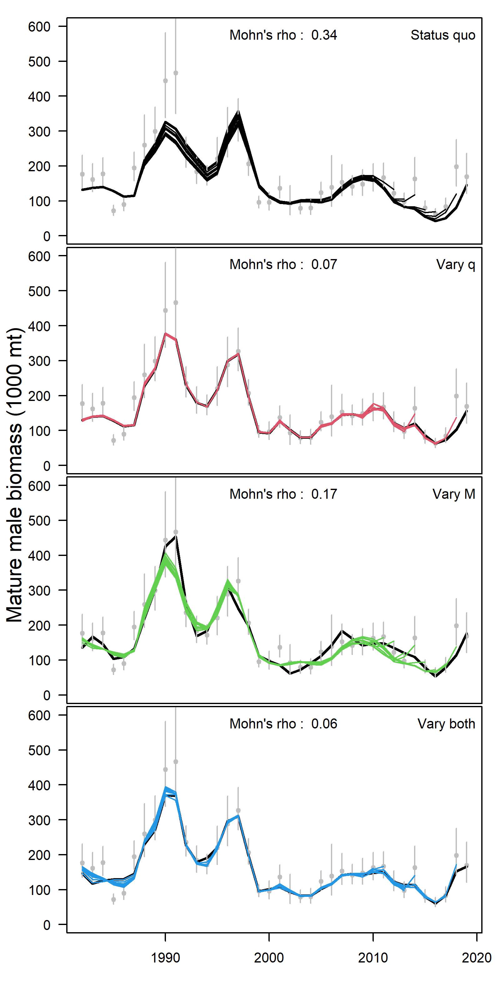

```{r, include=FALSE}

knitr::opts_chunk$set(echo=FALSE,message=FALSE,warning=FALSE)

library(plyr)
library(dplyr)
library(knitr)
library(ggplot2)
library(PBSmodelling)
library(pander)
library(coda)
library(maps)
library(lattice)
library(PBSmapping)
library(mapdata)    #some additional hires data
library(maptools)   #useful tools such as reading shapefiles
library(mapproj)
library(plotrix)

in_path<-"C:/gmacs/gmr/R/"
library(ggridges)
library(reshape2)
library(miceadds)
source.all( path=in_path, grepstring="\\.R",  print.source=TRUE, file_sep="__"  )

#source("plot.bubble.residuals.addn.R")

```


```{r,echo=F,message=FALSE,warning=F,include=FALSE}

survey_fig_N<-7
ABC_buffer  <-0.5
chosen_model<-"opilio"
chosen_ind<-1
ChosenInd<-1

#===PULL gmacs DATA AND outputs

#===============
# directory in which all of the scenario folder reside and names of the scenario folders
Scenarios   <-c("20_sq","20_sq_q","20_sq_m","20_sq_both")
ScenarioNames<-c("Status quo","Vary q","Vary M","Vary both")

#==make a list of the scenario names
##==save all of the output from the scenarios
snowad.rep<-rep(list(list()),length(Scenarios))
CatchYrN<-rep(list(list()),length(Scenarios))
SurvYrN<-rep(list(list()),length(Scenarios))
DiscYrFN<-rep(list(list()),length(Scenarios))
DiscYrMN<-rep(list(list()),length(Scenarios))
TrawlYrN<-rep(list(list()),length(Scenarios))
ObsCatchNumbers<-rep(list(list()),length(Scenarios))
ObsCatchPounds<-rep(list(list()),length(Scenarios))
RetCatchYrs<-rep(list(list()),length(Scenarios))
TotCatchYrs<-rep(list(list()),length(Scenarios))
ObsDiscF<-rep(list(list()),length(Scenarios))
ObsDiscM<-rep(list(list()),length(Scenarios))
TrawlBycatch<-rep(list(list()),length(Scenarios))
SurveyNumbers<-rep(list(list()),length(Scenarios))
SurveyYrs<-rep(list(list()),length(Scenarios))
LengthBins<-rep(list(list()),length(Scenarios))
GrowthNfem<-rep(list(list()),length(Scenarios))
GrowthNm<-rep(list(list()),length(Scenarios))
GrowthData<-rep(list(list()),length(Scenarios))

REPfileEnd<-rep(list(list()),length(Scenarios))
MgmtQuants<-rep(list(list()),length(Scenarios))

# names(snowad.rep[[ChosenInd]])
# snowad.rep[[ChosenInd]]$"Predicted probability of maturing female" 
# snowad.rep[[ChosenInd]]$"Predicted probability of maturing male" 

for(x in 1:length(Scenarios))
{
  snowad.rep[[x]]  <-readList(paste(Scenarios[x],"/R_input.txt",sep=""))

DATfile <-readLines(paste(Scenarios[x],"/2016sc.DAT",sep=""))

# length of data types
tmp<-grep("number of years of retained fishery data",DATfile)
CatchYrN[[x]] <-as.numeric(DATfile[tmp+1])
tmp<-grep("number of years of survey data",DATfile)
SurvYrN[[x]] <-as.numeric(DATfile[tmp+1])
tmp<-grep("number of years of fishery discard",DATfile)
DiscYrFN[[x]] <-as.numeric(DATfile[tmp+1])
tmp<-grep("number of years of fishery male discard",DATfile)
DiscYrMN[[x]] <-as.numeric(DATfile[tmp+1])
tmp<-grep("number of years of trawl discard",DATfile)
TrawlYrN[[x]] <-as.numeric(DATfile[tmp+1])

# observed retained catch
tmp<-grep("retained catch in numbers",DATfile)
ObsCatchNumbers[[x]]<-as.numeric(DATfile[(tmp+1):(tmp+CatchYrN[[x]])])[1:CatchYrN[[x]]]
tmp<-grep("retained catch in pounds",DATfile)
ObsCatchPounds[[x]]<-as.numeric(DATfile[(tmp+1):(tmp+CatchYrN[[x]])])[1:CatchYrN[[x]]]
tmp<-grep("years for fishery data",DATfile)
RetCatchYrs[[x]]<-as.numeric(unlist(strsplit(DATfile[(tmp+1)],split=" ")))
RetCatchYrs[[x]]<-RetCatchYrs[[x]][!is.na(RetCatchYrs[[x]])]

tmp<-grep("years when have fishery discard length data",DATfile)
TotCatchYrs[[x]]<-as.numeric(unlist(strsplit(DATfile[(tmp+1)],split=" ")))
TotCatchYrs[[x]]<-TotCatchYrs[[x]][!is.na(TotCatchYrs[[x]])]

# observed discard
tmp<-grep("Discard Catch from observer",DATfile)
ObsDiscF[[x]]<-as.numeric(DATfile[(tmp+2):(tmp+1+CatchYrN[[x]])])[1:CatchYrN[[x]]]
tmp<-grep("discard catch males",DATfile)
ObsDiscM[[x]]<-as.numeric(DATfile[(tmp+1):(tmp+CatchYrN[[x]])])[1:CatchYrN[[x]]]

# observed trawl
tmp<-grep(" bycatch numbers by geartype",DATfile)
TrawlBycatch[[x]]<-as.numeric(DATfile[(tmp+2):(tmp+1+CatchYrN[[x]])])[1:CatchYrN[[x]]]

# survey numbers
tmp<-grep("survey numbers by year",DATfile)
SurveyNumbers[[x]]<-as.numeric(DATfile[(tmp+1):(tmp+SurvYrN[[x]])])
tmp<-grep("years for survey data",DATfile)
SurveyYrs[[x]]<-na.omit(as.numeric(unlist(strsplit(DATfile[(tmp+1)],split=" "))))

tmp<-grep("length bins",DATfile)[[5]]
LengthBins[[x]]<-as.numeric(unlist(strsplit(DATfile[(tmp+1)],split=" ")))
LengthBins[[x]]<-LengthBins[[x]][!is.na(LengthBins[[x]])]

tmp       <-grep("growth data female",DATfile)
GrowthNfem[[x]]<-as.numeric(DATfile[(tmp+1)])
tmp1      <-grep("growth data male",DATfile)
GrowthNm[[x]]  <-as.numeric(DATfile[(tmp1+1)])
GrowthData[[x]]<-matrix(NA,ncol=4,nrow=max(GrowthNm[[x]],GrowthNfem[[x]]))

GrowthData[[x]][1:GrowthNfem[[x]],1] <-na.omit(as.numeric(unlist(strsplit(DATfile[(tmp+2)],split="\t"))))
GrowthData[[x]][1:GrowthNfem[[x]],2] <-na.omit(as.numeric(unlist(strsplit(DATfile[(tmp+3)],split="\t"))))

GrowthData[[x]][1:GrowthNm[[x]],3]  <-na.omit(as.numeric(unlist(strsplit(DATfile[(tmp1+2)],split="\t"))))
GrowthData[[x]][1:GrowthNm[[x]],4] <-na.omit(as.numeric(unlist(strsplit(DATfile[(tmp1+3)],split="\t"))))

#==pulling MLEs for management quantities
for(x in 1:length(Scenarios))
{
  REPfileEnd[[x]]       <-readLines(paste(Scenarios[x],"/2016sc.REP",sep=""))
  MgmtQuants[[x]]       <-as.numeric(unlist(strsplit(as.character(REPfileEnd[[x]][1]),split=" ")))
  MgmtQuants[[x]]$Status<-as.numeric(MgmtQuants[[x]][5])/as.numeric(MgmtQuants[[x]][2])
  names(MgmtQuants[[x]])<-c("F","BMSY","Surv_MMB","Fish_MMB","Mate_MMB","F35","FOFL","OFL","Status")
  }
}


#==MLE stuff
#==set up storage
  mle_B35<-list()
  mle_F35<-list()
  mle_FOFL<-list()
  mle_OFL<-list()
  mle_MMB<-list()
  mle_projMMB<-list()
  mle_ABC<-list()
  mle_Status<-list()
  mle_Status2<-list()
  mle_allMMB<-list()

  #==CHECK THIS  
for(x in 1:length(Scenarios))
{  
 REPfile <-readLines(paste(Scenarios[x],"/2016sc.REP",sep=""))
 temp <-as.numeric(unlist(strsplit(REPfile[1],split=" ")))
 temp <-temp[!is.na(temp)]
 mle_B35[[x]] <-temp[2]
 mle_F35[[x]] <-temp[6]
 mle_FOFL[[x]]<-temp[7]
 mle_OFL[[x]] <-temp[8]
 mle_MMB[[x]] <-temp[5]    
 mle_ABC[[x]]<-mle_OFL[[x]]*ABC_buffer
 mle_Status[[x]]<-mle_MMB[[x]]/mle_B35[[x]]

 mle_projMMB[[x]]<-snowad.rep[[x]]$"Mature male biomass at mating"[SurvYrN[[x]]]
 mle_allMMB[[x]]<-snowad.rep[[x]]$"Mature male biomass at mating"
 mle_Status2[[x]]<-mle_projMMB[[x]]/ mle_B35[[x]]
   
}
  
 B35<-mle_B35
 F35<-mle_F35
 FOFL<-mle_FOFL
 OFL<-mle_OFL
 MMB<-mle_MMB    
 ABC<-mle_ABC
 Status<-mle_Status 
 projMMB<-mle_projMMB
 proj_Status<-mle_Status2
 
 # organize data_2020
# repfile20<-scan("20_gmacs_3_proj_rec/mcoutSSB.REP")
# hist_ssb20<-matrix(repfile20,ncol=length(seq(1982,2019)),byrow=T)
# colnames(hist_ssb20)<-seq(1982,2019)
# 
# innames<-c("Draw","Replicate","Treatment",paste("F",seq(1,length(M[[1]]$log_fbar))),
#            "B35",paste("proj_ssb_",seq(2020,2025)))
# projfile20<-as.data.frame(matrix(scan("20_gmacs_3_proj_rec/mcoutPROJ.REP"),ncol=length(innames),byrow=TRUE))
# colnames(projfile20)<-innames
# 
# ind<-grep('ssb',colnames(projfile20))
# adj_proj20<-dplyr::filter(projfile20,Replicate==1& Treatment==3)
# proj_ssb20<-cbind(hist_ssb20,adj_proj20[,ind])
# colnames(proj_ssb20)<-seq(1982,2025)
# 
# proj_ssb_1<-proj_ssb20[1,]
# 
#  proj_ssb_19<-proj_ssb_1[colnames(proj_ssb_1)==2019]
#  proj_ssb_20<-proj_ssb_1[colnames(proj_ssb_1)==2020] 

```


Population dynamics models used to provide management advice for harvested natural resources often estimate population processes that can be mutually confounded. These processes (e.g., natural mortality (*M*) and catchability (*q*)) are often assumed to be time-invariant, but this assumption can be violated in real populations. Not allowing for time-variation in these processes can result in retrospective patterns in estimated biomass, which can result in errors in management advice. Allowing for time-variation in these processes can also result in errors in management advice if the estimated time-variation does not reflect the true underlying variation. Here I present a population dynamics model for snow crab in the eastern Bering Sea that tests different combinations of implementation of time-variation in *M* and *q*.  The North Pacific Fisheries Management Council did not adopt any of the models with time-variation in *M* or *q* for management because the estimated variability in *M* and *q* was difficult to explain with any known mechanism and management advice differed by nearly an order of magnitude among models. Large differences in management advice underscores the importance of evidence-based approaches to incorporating time-variation in population processes into stock assessment models.

\newpage
# Introduction

Modeling the dynamics of populations often requires making simplifying assumptions to produce tenable models. For example, in fisheries stock assessments, population processes like natural mortality (*M*), catchability (*q*), growth, and maturity are often assumed to be time-invariant. However, these assumptions have been shown to be false for some populations. For example, Wilberg et al. (2009) collated published evidence for changes in catchability for harvested marine population, Stawitz et al. (2019) demonstrated considerable variabilty in growth for stocks in the Bering Sea, and Jacobsen and Essington (2018) cataloged changes in natural mortality for forage fish in European waters. 

Addressing the potential that other confounded processes are not driving observed changes in a stock is a key concern when estimating time-variation in stock assessment. Similar changes in the observed indices of abundance can be caused by changes in natural mortality, selectivity, growth, or catchability (e.g., Thompson, 1994). For example, a decline in biomass in the terminal year of the time series can arise from increased natural mortality, decreased selectivity or catchability, or decreases in growth. This confounding can lead to the dilemma of 'Kill them or hide them?' when assessing stocks in which there are unexpected declines (Taylor and Methot, 2013). Data to distinguish between mortality events and changes in selectivity are often difficult to procure and, even when the data are possible to collect, may arrive after the point in time at which they are needed to establish management advice (e.g., the next year's survey data). In spite of this, the analyst must make modeling decisions about how to reconcile changes in observed abundance or biomass to provide management advice.

Given the above issues, population dynamics models used to manage harvested natural resources often seek to strike a balance between simplicity and complexity in modeling assumptions that appropriately captures the processes important in determining sustainable harvests (e.g., natural mortality, growth, selectivity, catchability, and maturity) while respecting the information content in the data. In general, three pieces of information are needed in harvest control rules that produce catch recommendations: biomass at the time of the next fishery, a target biomass, and a target fishing mortality. Broadly speaking, these pieces represent the current status of a fishery, the target status for a fishery, and the pathway for how to achieve the target from the current situation. Oftentimes the biomass and fishing mortality targets are based on maximum sustainable yield calculations (e.g., Schaefer, 1954) or proxies thereof (e.g Clark, 1991).

Each of these pieces of information can be influenced by the assumptions about population processes made while developing a population dynamics model. Assuming time-invariance in the population processes that influence estimates of current biomass when those processes are actually varying can produce retrospective patterns and lead to ineffective management advice (e.g., NOAA, 2009). Assuming time-invariance in the population processes that determine the management targets for biomass and fishing mortality may be reasonable if the forcing of these processes is stationary because the targets should represent the mean state of the system. However, if the environmental forcing of these processes is non-stationary (i.e. the mean changes over time), changes in population processes result in changes in management quantities (Thorson et al. 2015) and decisions must be made about the time period used as a reference to calculate management targets (NPFMC, 2007).  

Snow crab in the eastern Bering Sea is one such stock that appears to have time-variation in some population processes (e.g., natural mortality in Murphy et al. 2018; catchability in Somerton et al. 2013) and models have been proposed for other stocks of snow crab that include time-varying *M* (Shibata et al., 2021). The eastern Bering Sea population is at least at risk of non-stationarity in some population processes (particularly those related to ice extent like recruitment; Szuwalski et al., 2020). Consequently, we use it here as a case study to explore the potential to estimate time-variation in confounded population processes. 

The snow crab fishery has been managed with individual transferable quotas since 2005 and retains large male crab with carapace width greater than 101 mm (\autoref{fish_hist}; Szuwalski, 2021). Catches were highest in the 1990s, after which the stock biomass declined sharply and the stock was declared overfished in 1999. The stock was declared 'rebuilt' in 2011 once the estimated biomass exceeded the biomass management target. The National Marine Fishery Services (NMFS) summer trawl survey is a key information source in the stock assessment for snow crab. Crab cannot be aged, so true cohorts are not known, however groups of crab of similar size clearly move through the population and are dubbed 'pseudocohorts'. Large 'pseudocohorts' have appeared in the survey three times since 1982 (\autoref{fish_hist} and \autoref{n_at_len}). 

The most recent large pseudocohort was spawned around 2010 and first selected by the survey gear in 2015 (Szuwalski et al., 2020). By 2018, it was the largest pseudocohort ever observed in the eastern Bering Sea. However, in 2019, it was much smaller than expected given estimated growth, natural mortality, and fishing removals (\autoref{n_at_len}). This strongly implies time-variation in some population process and catchability or natural mortality are key suspects given previous research. However, there are few data to decisively indicate which process is varying over time. No survey was performed in 2020 as a result of the coronavirus pandemic, so the managing body was in the unprecedented position of setting the overfishing level (i.e. the level of catch beyond which overfishing would occur, which is used to set allowable biological catches) in a year with no survey data and in the context of a large drop in the previous year of survey data that could be attributed to changes in either natural mortality or catchability.

Here I present iterations of the assessment method used for snow crab that incorporate time-variation in natural mortality and/or catchability. I then compare the resulting fits to the data, evaluate the character and credibility of the estimated time-variation in *q* and *M*, and examine the knock-on effects in other confounded processes like maturity and recruitment. I conclude by presenting the differences in management-related quantities, summarizing the discussion the management body held concerning these models, and discussing potential paths forward.   

# Methods
The integrated size-structured model currently used (referred to here as the 'status quo' model) was developed by Turnock (2015) following Fournier and Archibald's (1982) methods, with many similarities to Methot (1990). The population dynamics in the status quo model tracks the number of crab of sex *s*, maturity state *m*, during year *y* at width *w*, N~*s,m,y,w*~. A terminal molt occurs in which crab move from an immature to a mature state, after which no further molting occurs. The mid-points of the size bins tracked in the model span from 27.5 to 132.5 mm carapace width, with 5 mm size classes. Parameters estimated within the assessment include those associated with recruitment, natural mortality, fishing mortality, selectivity (fishery and survey), survey catchability, and probability of having undergone terminal molt.  Weight at size, discard mortality, bycatch mortality, and parameters associated with the variance in growth and proportion of recruitment allocated to size bin were estimated outside of the model or specified. Growth parameters were estimated outside of the model based on measurements of pre-molt and post-molt carapace width for crab captured in the wild just prior to molting. Survey biomass indices and size-composition data, directed fishery biomass and size-composition data, and bycatch biomass and size-composition data were fit to within the assessment. The assessment spans the years 1982 to 2020. See appendix A for a complete description of the population dynamics and model code is available on a github repository linked at the end of this manuscript. 

The output of three models are compared to the status quo here: "Vary *M*", "Vary *q*", and "Vary both". Each of these models builds on the status quo model and alters the way in which natural mortality ("Vary *M*"), catchability ("Vary *q*"), or both processes ("Vary both") are modeled. "Vary *M*" adds a vector of deviations to the existing estimated parameters for mature natural mortality of both sexes (i.e. a 'dev_vector' in AutoDifferentiating Model Builder; Fournier et al., 2012). The vector of deviations includes an additional parameter for each year included in the assessment (1982-2020) for each sex. "Vary *q*" estimates a catchability parameter for each year from 1989-2020 for each sex. The estimated vectors of *q* are bounded by 0.2 and 1.0 based information from experimental net efficiency work for Bering Sea snow crab that suggests catchability should be within this range (Somerton et al., 2013). "Vary both" combines these changes into a single model. A smoothing penalty is added to the negative log likelihood of each model to allow model convergence The smoothing penalty is the squared norm of the second difference of each vector of additionally estimated parameters multiplied by a user-defined weighting factor. The weights for the smoothing penalties were chosen by trial and error, with the aim of making them as small as possible while still avoiding convergence issues.

Retrospective analyses were performed in which the terminal year of data was removed sequentially from the model fitting, then estimated management quantities (e.g., mature male biomass [MMB]) were compared between the model with the complete data set (i.e. 1982-2020) and models with successive 'peels' of the data to identify retrospective patterns. A retrospective pattern is a consistent directional change in assessment estimates of management quantities in a given year when additional years of data are removed from an assessment. Mohn's rho (which computes the average difference between the reference case and the peels over the period of retrospective analysis; Mohn, 1999) was calculated for each model to quantify the retrospective patterns in the estimate of the terminal year of biomass. 

The overfishing level (OFL) is the level of catch beyond which overfishing would be deemed to occur in a given year. The OFL is one of the key pieces of management advice that arises from the assessment and serves as the starting point for specifying an 'acceptable biological catch', which constrains removals in the fishery. The OFL was calculated using spawner-per-recruit proxies for biomass and fishing mortality reference points (e.g., Clark, 1991) and a sloped control rule. After fitting the assessment model to the data, the model was projected forward 100 years using the estimated parameters under no exploitation and constant recruitment to determine 'unfished' MMB-per-recruit. For models in which time-variation was implemented, the average of the final seven years of the process was used in projections. The bisection method was used iteratively to identify a fishing mortality that reduced the MMB-per-recruit to 35% of the unfished level (i.e. F~35%~ and B~35%~). Calculations of F~*35%*~ were made under the assumption that bycatch fishing mortality was equal to the estimated average value.

Calculated values of F~35%~ and B~35%~ were used in conjunction with a sloped control rule to adjust the proportion of F~35%~ that is applied based on the status of the population relative to B~35%~ (Amendment 24, NMFS; NPFMC, 2007).

\begin{equation}
 F_{OFL} =
 \begin{cases}
 Bycatch only  & if \frac{MMB}{MMB_{35}} \leq 0.25 \\[3ex]
 \frac {F_{35} ( \frac {MMB}{MMB_{35}} - \alpha)}{1-\alpha}  & if  0.25 < \frac {MMB}{MMB_{35}} < 1 \\[3ex]
 F_{35} & if MMB \geq MMB_{35}
\end{cases}
\end{equation}

Where MMB is the projected MMB in the current survey year after fishing at the F~*OFL*~, MMB~*35%*~ is the equilibrium MMB at the time of mating resulting from fishing at F~*35%*~, F~*35%*~ is the fishing mortality that reduces the MMB-per-recruit to 35% of unfished levels under constant recruitment, and $\alpha$ determines the slope of the descending limb of the harvest control rule (set to 0.1 here as specified by the NPFMC).  

# Results

All models produced a positive-definite Hessian and had maximum gradient components less than 0.004, except "Vary both", which had a maximum gradient component of 0.01 for one of the recruitment deviations for males (the rest were < 0.004). The smallest viable smoothing penalties tested were 1 and 10 for natural mortality and catchability (respectively) when they were the only additional time-varying process in the assessment. When both processes were allowed to vary, the smoothness penalty for natural mortality had to be increased to 15 or the model did not converge.  

## Fits to the data

Models "Vary *M*", "Vary *q*", and "Vary both" all fit the survey MMB better than the status quo model (\autoref{mmbfits} and \autoref{objfun}), particularly in recent years (\autoref{sm_mmbfits}). The status quo model missed the input confidence intervals of 5 of the last 6 years of survey MMB, but additional estimated time-variation improved these fits. Fits to the catch data, growth data, and all size-composition data sources can be seen in the supplementary materials. In general, the fits were similar across models, except for the survey size-composition data, in which there are several years in which models that allowed for additional time-variation produce much better fits than models that did not. Retrospective patterns in the status quo model (Mohn's rho = 0.34) were improved substantially by allowing additional time-variation in either natural mortality or catchability (\autoref{retro_mult}). 

## Estimated population processes and derived quantities

Estimated population processes and derived quantities varied among models. The trajectories of the time series of estimated MMB varied strongly among models, and model "Vary both" produced the largest historical estimates of MMB (\autoref{predmmb}). The shapes of the estimated curve representing the probability of undergoing terminal molt for males were similar among models, but the magnitude of the probabilities varied, most strongly for males in the 70-90 mm carapace width range (\autoref{est_pop_proc}). 'Vary both' estimated the highest fraction of sub-industry-preferred size (i.e. <101 mm carapace width) crab undergoing terminal molt. Trajectories of estimated fishing mortality were similar across models, but variability within years existed due to differing estimates of population size (\autoref{est_pop_proc}). Patterns in estimated recruitment were similar for all models, but the relative magnitudes varied (\autoref{est_pop_proc}). 

Estimated natural mortality across models varied widely (\autoref{vary_nat_m_q}). Both 'Vary both' and 'Vary *M*' estimated higher natural mortality in recent years compared to historical estimates, but estimates from 'Vary both' increased sharply starting in 2017 and ended with estimates in 2020 nearly double that of 'Vary *M*'. Estimates of mean natural mortality were smaller for models in which natural mortality was allowed to vary over time than for those in which natural mortality was constant over time. The shapes of the estimated survey selectivity curves were similar among all models; the largest changes were seen in the catchability coefficient (see supplementary figure 11). Models in which catchability was time-varying estimated average catchabilities similar to the experimentally implied catchability. However, the variability in estimated catchability for these models was large, with estimated values ranging from ~0.2 to ~1 (\autoref{vary_nat_m_q}). 

Differences in estimated population processes and fits to the data resulted in large differences in management advice (\autoref{stepchange}). The terminal year of estimated MMB varied from 43,290 t to 133,510 t, with models estimating time-varying *M* returning much lower MMB than those that did not. The corresponding target biomasses (B~35%~) were also much lower for models incorporating time-varying *M* because the projections used to calculate B~35%~ are based on the terminal years of estimated *M*, which were quite high (\autoref{vary_nat_m_q}). An additional effect of increases in estimated *M* (and changes in the probability of terminally molting; \autoref{est_pop_proc}) were large increases in F~35%~ (\autoref{stepchange}). In spite of large differences in the estimated MMB, the management advice from 'Vary *q*' was only 10% more than 'Vary *M*' (77.08 vs. 70.88 kt). This similarity in OFLs is a function of the large F~35%~ and small B~35%~ from 'Vary *M*' relative to 'Vary *q*'. However, if both processes were allowed to vary in the assessment ('Vary both'), the calculated OFL was 81% smaller than the when only one process was allowed to vary. Furthermore, if the smoothness penalty used for 'Vary both' was used in 'Vary *M*', the calculated OFLs were similar, suggesting relatively unstable estimation of time-varying *M*.

# Discussion
Time-variation in population processes appears to be an issue for snow crab, but data to inform changes in population processes over time are lacking. Allowing *M* or *q* to vary over time within the assessment lead to improved fits to the data and reductions in retrospective patterns, but the management advice differed by almost an order of magnitude depending on what processes were allowed to vary and how the processes were constrained within the estimation process. Further, estimates of time-varying natural mortality among assessment variants and other published models fit to the same data (Murphy et al., 2018) were quite different in character (\autoref{vary_nat_m_q}). Ultimately, the Crab Plan Team, which is the first level of peer review for the assessments used for crab in the Bering Sea, chose not to endorse models that allowed time-varying *q* or *M* for use in management because the estimates of *q* and *M* varied more drastically than seemed reasonable and there was no clear mechanism to support the variability.

Improvements in fit and reductions in retrospective patterns with additional model flexibility is an expected outcome and is not unique to either snow crab or size-structured models. Szuwalski et al. (2019) demonstrated a similar outcome in a simulation study based on a cod-like life history with age-structured assessment models. Retrospective patterns were induced by simulating data with time-variation in growth, selectivity, or natural mortality and fitting assessment models that did not model time-variation in those processes. Next, assessment models that allowed either growth, selectivity, or natural mortality were fit to the data. Implementing any of these time-varying processes reduced the magnitude of retrospective patterns, but management advice resulted in over- or under-exploiting the stock if the incorrect process was allowed to vary. One of the main recommendations of the paper was that an understanding of what process is time-varying is recommended before implementation of time-variation in integrated assessments. The lack of a mechanistic understanding for changes in snow crab was the primary reason the candidate models with time-variation in *M* and/or *q* were not used in management.

Much effort has been expended exploring methods to estimate time-variation in natural mortality and selectivity in recent years (e.g., Miller and Hyun, 2017; Jiao et al. 2012; Jacobsen et al. 2019). The CAPAM special issue on selectivity (Maunder et al., 2014) presented papers on methodology for using random-effects to estimate time-variation in selectivity (Nielsen and Berg, 2014) and best practices in modeling time-varying selectivity (Martell and Stewart, 2014). Simulation studies have been used to suggest that estimating *M* at a minimum should be the default in stock assessment (Johnson et al., 2014). More recently, Aldrin et al. (2021) suggested that accounting for variability across time using simple models improves performance over time-invariant *M*. 

In spite of the effort spent estimating time-varying catchability, selectivity, and natural mortality individually, less effort has been spent understanding the feasibility of estimating time-variation in multiple confounded processes within a stock assessment. This is perhaps because the confounding of processes like natural mortality and catchability is recognized as a central challenge in assessment even without considering time-variation (Maunder and Piner, 2014). It has also been shown to be difficult to estimate time variation in a single population process with the data often available for population dynamics modeling, much less two (Johnson et al., 2014, Lee et al., 2011). However, moving forward, the need to estimate time-variation in multiple processes will likely be an increasingly prevalent problem as populations respond to a changing environment (Szuwalski and Hollowed, 2016). Changes in distribution (Pinksy et al., 2013), recruitment (Szuwalski et al., 2015), growth (Audzijonyte et al., 2020), and natural mortality (Audzijonyte et al., 2016) are already being observed in harvested marine populations. If appropriate ways of incorporating multiple processes varying over time into assessment cannot be found, retrospective patterns and erroneous management advice will become increasingly common. This may result in an eroded potency of previously effective management (Hilborn et al., 2021). 

Given the outcomes of this analysis, it is not clear if the estimation of time-variation in confounded processes is a problem we can model our way out of with the currently available data for snow crab. Completing these sorts of analyses with a wider range of life histories and data availabilities (both real world and simulated) could be useful to better understand the potential for estimating time-variation in confounded processes in stock assessment. Attention to how to specify smoothness parameters would be useful for practical implementation of time-varying processes in stock assessment given their impact on the analysis here. More longitudinal data are likely needed to directly inform the estimation of time-variation in confounded processes, but the continuous tagging, laboratory, and net efficiency studies that would be needed to provide these data will be expensive. So, cost-benefit analyses aimed at understanding the value of information derived from the needed studies to estimate time-variation in confounded processes should also be performed. These analyses could include management strategy evaluations aimed at understanding the improvement in management outcomes coming from assessments that can estimate time-variation in confounded processes and simpler strategies that do not attempt to do so.


# Acknowledgments
I'd like to thank Jack Turnock for passing the status quo code down to me upon his retirement. I also thank Kelli Johnson and Shareef Siddeek for comments that improved this manuscript.

# Supplementary materials
The github repository including the code used to perform the analysis and additional figures describing the fit of the models to the data can be found at: https://github.com/szuwalski/snow_time_m.

\newpage

# References

Aldrin, M., Aanes, F.L., Tvete, I.F., Aanes, S., Subbey, S. 2021. Caveats with estimating natural mortality rates in stock assessment models using age-aggregated catch data and abundance indices. Fish. Res. doi.org/10.1016/j.fishres.2021.106071 

Audzijonyte, A., Richards, S.A., Stuart-Smith, R.D., Pecl, G., Edgar, G.J., Barrett, N.S., Payne, N., Blanchard, J.L. 2020. Fish body sizes change with temperature but not all species shrink with warming. Nat. Eco. Evo. 4(6): 809-814.

Audzijonyte, A., Fulton, E., Haddon, M., Helidoniotis, F., Hobday, A.J., Kuparinen, A., Morrongiello, J., Smith, A.D.M., Upston, J., Waples, R. 2016. Trends and management implications of human-influenced life-history changes in marine ectotherms. Fish Fish. 17(4): 1005-1028.

Clark, W.G. 1991. Groundfish exploitation rates based on life history parameters. Can. J. Fish. Aquat. Sci.
48: 734-750.

Fournier, D.A. and C.P. Archibald. 1982.  A general theory for analyzing catch-at-age data. Can. J. Fish. Aquat. Sci. 39:1195-1207.

Fournier, D.A., H.J. Skaug, J. Ancheta, J. Ianelli, A. Magnusson, M.N. Maunder, A. Nielsen, and J. Sibert. 2012. AD Model Builder: using automatic differentiation for statistical inference of highly parameterized complex nonlinear models. Optim. Methods Softw. 27:233-249.

Hilborn, R., Amoroso, R.O., Anderson, C.M., Baum, J.K., Branch, T.A., Costello, C., De Moor, C.L., Faraj, A., Hively, D., Jensen, O.P., Kurota, H., Little, R.L., Mace, P., McClanahan, T., Melnychuk, M.C., Minto, C., Osio, G.C., Parma, A.M., Pons, M., Segurado, S., Szuwalski, C.S., Wilson, J.R., Ye, Y. 2021. Effective fisheries management instrumental in improving fish stock status. Proc. Natl. Acad. Sci. 117(4): 2218-2224.

Jacobsen, N.S., Essington, T.E. 2018. Natural mortality augments population fluctuations of forage fish. Fish Fish. 19(5): 791-797.

Jacobsen, N.S., Thorson, J.T., Essington, T.E. 2019. Detecting mortality variation to nehance forage fish population assessments. ICES J. Mar. Sci. 76(10): 124-135.

Jiao, Y. Smith. E.P. O'Reilly, R., Orth, D.J. 2012. Modelling non-stationary natural mortality in catch-at-age models. ICES J. Mar. Sci. 69(1): 105-118.

Johnson, K.F., Monnahan, C.C., McGilliard, C.R., Vert-Pre, K.A., Anderson, S.C., Cunningham, C.F., Hurtado-Ferro, F., Licandeao, R.R., Muradian, M.L., Ono, K., Szuwalski, C.S., Valero, J.L., Whitten, A.R., Punt, A.E. 2014. Time-varying natural mortality in fisheries stock assessment models: identifying a default approach. ICES J. Mar. Sci. 72(1): 137-150.

Lee, H.H., Maunder, M.N., Piner, K.R., Methot, R.D. 2011. Estimating natural mortality within a fisheries stock assessment model: An evaluation using simulation analysis based on twleve stock assessment. Fish. Res. 109(1): 89-94.

Martell, S., Stewart, I. 2014. Towards defining good practices for modeling time-varying selectivity. Fish. Res. 158 84-95.

Maunder, M.N. Piner, K.R. 2014. Contemporary fisheries stock assessment :many issues still remain.  ICES. J. Mar. Sci. 71(10): 7-18. 

Maunder, M.N., Crone, P.R., Valero, J.L., Semmens, B.X. 2014. Selectivity: Theory, estimation, and application in fishery stock assessment models. Fish. Res. 158: 1-4. 

Methot, R.D.  1990.  Synthesis model: An adaptable framework for analysis of diverse stock assessment data.  Int. N. Pac. Fish. Comm. Bull. 50:259-277.

Miller, T.J. and Hyun, S.Y. 2017. Evaluating evidence for alternative natural mortality and process error assumptions using a state-space, age-structured assessment model. Can. J. Fish. Aquat. Sci. 75(5): 691-703.

Mohn R. 1999. The retrospective problem in sequential population analysis: an investigation using cod fishery and simulated data, ICES J. Mar. Sci. 56: 473-488. 

Murphy, J.T., Rugolo, L.J., Turnock, B.J. 2018. Estimation of annual, time-varying natural mortality and survival for Eastern Bering Sea snow crab with state-space population models. Fish. Res. 205: 122-131.

Nielsen, A., Berg, C.W. 2014. Estimation of time-varying selectivity in stock assessments using state-space models. Fish. Res. 158: 96-101.

NOAA, Report of the retrospective working group. Northeast Fisheries Science Center Reference Documents, 09-01, 2009. Woods Hole, MA. National Oceanic and Atmospheric Administration http://www.nefsc.noaa.gov/nefsc/publications/crd/crd0901/crd0901.pdf

NPFMC (North Pacific Fishery Management Council).  2007.  Environmental Assessment for Amendment 24.  Overfishing definitions for Bering Sea and Aleutian Islands King and Tanner crab stocks.  North Pacific Fishery Management Council,Anchorage, AK, USA..

Pinsky, M.L., Worm, B., Fogarty, M.J., Sarmiento, J.L. Levin, S.A. 2013. Marine taxa track local climate velocities. Science. 341(6151): 1239-1242.

Schaefer, M.B. 1954. Some aspects of the dynamics of populations important to the management of commercial marine fisheries. Bull. Int. Am. Trop. Tuna. Com. 1(2): 27-56.

Shibata, Y. Nagao, J. Narimatsu, Y. Eisuke, M., Suzuki, Y., Tokioka, S., Yamada, M., Kakehi, S., Okamura, H. 2021. Estimating the maximum sustainable yield of snow crab off Tohoku, Japan via a state-space stock assessmnt model with time-varying natural mortality. Pop. Ecol. 63: 41-60.

Somerton, D.A. Weinberg, K.L., Goodman, S.E. 2013. Catchability of snow crab by the eastern Bering Sea bottom trawl survey estimated using a catch comparison experiment.  Can. J. Fish. Aquat. Sci. 70: 1699-1708.

Stawitz, C.C., Haltuch, M.A., Johnson, K.F. 2019. How does growth mis-specficiation affect management advice derived from an integrated fisheries stock assessment model? Fish. Res. 213: 12-21.

Szuwalski, C.S., Vert-Pre, K.A., Punt, A.E., Branch, T.A., Hilborn, R. 2015. Examining common assumptions about recruitment: a meta-analysis of recruitment dynamics for worldwide marine fisheries. Fish Fish. 16(4): 633-648.

Szuwalski, C.S. and Hollowed, A.B. 2016. Climate change and non-stationary population processes in fisheries management. ICES J. Mar. Sci. 73(5): 1297-1305.

Szuwalski, C.S., Ianelli, J.N., Punt, A.E. 2019. Reducing retrospective patterns in stock assessment and impacts on management performance. ICES J. Mar. Sci. 75(2): 596-609.

Szuwalski, C.S., Cheng, W., Foy. R., Hermann. A.J., Hollowed, A.B., Holsman, K., Lee, J., Stockhausen, W., Zheng, J.  2020. Climate change and the future productivity and distribution of crab in the eastern Bering Sea. ICES J. Mar. Sci. 78(2): 502-515.

Szuwalski, C.S. 2021. Stock assessment of Eastern Bering Sea snow crab. Stock Assessment and Fishery Evaluation Report for the King and Tanner Crab Fisheries of the Bering Sea and Aleutian Islands Regions. 2021 Crab SAFE. North Pacific Fishery Management Council, Anchorage, AK.

Taylor, I.G., Methot, R.D. 2013. Hiding or dead? A computationally efficient model of selective fisheries mortality. Fish. Res. 142: 75-85.

Then, A.Y., Hoenig, J.M., Hall, G.H., Hewitt, D.A. 2015. Evaluating the predictive performance of empirical estimators of natural mortality rate using information on over 200 fish species. ICES J. Mar. Sci. 72(1): 82-92.

Thomspon, G.G. 1994. Confounding of gear selectivity and natural mortality rate in cases where the former is a nonmonotone function of age. Can. J. Fish. Aquat. Sci. 51(12): 2654-2664.

Thorson, J.T., Monnahan, C.C., Cope, J.M. 2015. The potential impact of time-variation in vital rates on fisheries management targets for marine fishes. Fish. Res. 169: 8-17.

Turnock, B.J., 2015. Stock assessment of Eastern Bering Sea snow crab. Stock Assessment and Fishery Evaluation Report for the King and Tanner Crab Fisheries of the Bering Sea and Aleutian Islands Regions. 2016 Crab SAFE. North Pacific Fishery Management Council, Anchorage, AK, pp. 167–250.

Wilberg, M.J., Thorson, J.T., Linton, B.C., Berkson, J. 2009. Incorporating time-varying catchability into population dynamics stock assessment models. Rev. Fish. Sci. 18(1): 7-24.

\newpage

# Appendix A: Population dynamics model description

Numbers of sex *s* of shell condition *v* and maturity state *m* at width *w* in the initial year of the assessment, N~*s,v,m,y=1,w*~, were calculated from an estimated vector of numbers at width *w* by sex *s* and maturity state *m* for males, $\lambda_{s,m,l}$ and numbers at width *w* by sex *s* and shell condition *v* for females (i.e. 2 vectors for each sex were estimated). Estimated vectors of initial numbers at size by maturity for females were calculated by splitting the estimated vectors at size by the observed proportion mature in the first year of the survey.  Shell condition is differentiated in the input data for the assessment, but is aggregated over when likelihoods are calculated, so the brief description in the main text does not include shell condition.
 
\begin{equation} N_{s,v,m,y=1,w} = 
  \begin{cases}
  \Omega_{s,w}^{obs} \lambda_{s,1,w} & \text{if v = new; m = mat, s = fem} \\[2ex]
  1-\Omega_{s,w}^{obs} \lambda_{s,1,w} & \text{if v = new; m = imat, s = fem} \\[2ex]
  \lambda_{s,2,w} & \text{if v = old; m = mat, s = fem} \\[2ex]
  0 & \text{if v = old; m = imat} 
  \end{cases}
  \end{equation}

Initial numbers at size for males were all assumed to be new shell. 

\begin{equation} N_{s,v,m,y=1,w} = 
  \begin{cases}
   \lambda_{s,1,w} & \text{if v = new; m = mat, s = male} \\[2ex]
   \lambda_{s,2,w} & \text{if v = new; m = imat, s = male} \\[2ex]
  0 & \text{if v = old; m = mat, s = male} \\[2ex]
  0 & \text{if v = old; m = imat, s = male} 
  \end{cases}
  \end{equation}

The dynamics after the initial year were described by:

  \begin{equation} N_{s,v,m,y+1,w} = 
  \begin{cases}
  \Omega_{s,w}  \kappa_{s,w'} Q_{s,imat,y,w'} X_{s,w',w} & \text{if v = new; m = mat} \\[2ex] 
  1-\Omega_{s,w} \kappa_{s,w'} Q_{s,imat,y,w'} X_{s,w',w} + Rec^\epsilon_y Pr_{w} & \text{if v = new; m = imat} \\[2ex]
  Q_{s,mat,y,w'} & \text{if v = old; m = mat} \\[2ex]
  (1-\kappa_{s,w'}) Q_{s,imat,y,w'} & \text{if v = old; m = imat} 
  \end{cases}
  \end{equation}

Where $\Omega_{s,w}$ was the probability of having undergone terminal molt at width *w* for sex *s* (a freely estimated vector for both males and females constrained by penalties on smoothness), $\kappa_{s,w'}$ was the probability of molting for an immature crab of sex *s* at width *w* (set to 1 for all immature crab and zero for all mature crab), and X~*s,w,w'*~ was the size transition matrix describing the probability of transitioning from size *w'* to size *w* for sex *s*. Q~*s,m,y,w'*~ was the number of crab of sex *s*, maturity state *m*, and width *w* surviving natural and fishing mortality during year *y*:

 \begin{equation}
  Q_{s,m,y,w} = \sum_v N_{s,v,m,y,w}e^{Z_{s,v,m,y,w}} 
 \end{equation}
 
 Where N~*s,v,m,y,w*~ represented the numbers, *N*, of sex *s* during year *y* of shell condition *v* and maturity state *m* at width *w*. Z~*s,v,m,y,w*~ represented the total mortality experienced by the population and consisted of the sum of instantaneous rates of natural mortality by sex and maturity state, *M*~*s,m*~, and fishing mortality, F~*s,f,y,w*~ from each fishery. Each fishing mortality was subject to selectivity by width *w*, which varied between sexes *s* and fisheries *f* (and by year *y* if specified). M~*s,m*~ was specified in the model based on a maximum assumed age of 20 and Then et al.'s (2015) empirical study on relationships between life history characteristics and natural mortality. A multiplier $\gamma_{natM,m}$ was estimated subject to constraints (this formulation effectively specified a mean and standard deviation for a prior distribution for M).
 
 \begin{equation} Z_{s,v,m,y,w} = \gamma_{natM,m} M_{s,m} + \sum_f S_{s,f,y,w} F_{s,f,y,w} \end{equation}
 
Selectivities in the directed and bycatch fisheries were estimated logistic functions of size.  Different selectivity parameters were estimated for females and males in the directed fisheries (S~*fem,dir,w*~ and S~*male,dir,w*~, respectively), a single selectivity for both sexes was estimated for bycatch in the groundfish trawl fishery (S~*trawl,w*~), and a retention selectivity was estimated for the directed fishery for males (R~*dir,w*~; all females were discarded).
 
  \begin{align}
  S_{male,dir,w} = & \frac {1}{1+e^{-S_{slope,m,d}(W_{w}-S_{50,m,d}}}) \\
  S_{fem,dir,w} = & \frac {1}{1+e^{-S_{slope,f,d}(W_{w}-S_{50,f,d}}}) \\
  S_{trawl,w} = & \frac {1}{1+e^{-S_{slope,t}(W_{w}-S_{50,t}}}) \\
  R_{dir,w} = & \frac {1}{1+e^{-S_{slope,m,d}(W_{w}-S_{50,m,d}}})
  \end{align}

Where S~*slope,s,f*~ was the slope of the logistic curve for sex *s* in fishery *f* and S~*50,s,f*~ was the width at 50% selection for sex *s* in fishery *f*.  Catches for all fisheries were modeled as pulse fisheries in which all catch was removed instantaneously (i.e. no natural mortality occurred during the fishery). Catch in fishery *f* during year *y* was calculated as the fraction of the total fishing mortality, F~*s,f,y,w*~, applied to a given sex *s* in a fishery *f* times the biomass removed by all fisheries for that sex.

 \begin{align}
 C_{male,dir,y}  = & \sum_{w} \sum_{v} \sum_{m} w_{male,w} \frac {R_w F_{male,dir,y,w}}{F_{male,dir,y,w} + F_{trawl,y,w}} N_{male,v,m,y,w} e^{-\delta_y M_{s,m}} (1-e^{-(F_{male,dir,y,w}+F_{trawl,y,w})}) \\
 C_{male,tot,y}  = & \sum_{w} \sum_{v} \sum_{m} w_{male,w} \frac {F_{male,dir,y,w}}{F_{male,dir,y,w} + F_{trawl,y,w}} N_{male,v,m,y,w} e^{-\delta_y M_{s,m}} (1-e^{-(F_{male,dir,y,w}+F_{trawl,y,w})}) \\
 C_{fem,dir,y}   = & \sum_{w} \sum_{v} \sum_{m} w_{fem,w} \frac {F_{fem,dir,y,w}}{F_{fem,dir,y,w} + F_{trawl,y,w}} N_{fem,v,m,y,w} e^{-\delta_y M_{s,m}} (1-e^{-(F_{fem,dir,y,w}+F_{trawl,y,w})})  \\
 C_{m+f,trawl,y}  = & \sum_{s} \sum_{w} \sum_{v} \sum_{m} w_{s,w} N_{s,v,m,y,w} e^{-\delta_y M_{s,m}} (1-e^{-(F_{trawl,y,w})})
 \end{align}
 
Where $\delta_y$ was the mid point of the fishery (all fisheries were assumed to occur concurrently and the midpoint was based on the directed fishery, which accounts for the vast majority of the fishing mortality) and w~*s,w*~ was the weight at width *w* for sex *s*. Trawl data and discard data were entered into the model with an assumed mortality of 80% and 30%, respectively.  Fully-selected fishing mortality parameters for fishery *f* were estimated as a logged average over a given time period ($F^{log}_{avg}$) with yearly deviations around that mean ($F^{log}_{dev,y}$).

\begin{equation}
 F_{f,y} = e^{(F^{log}_{avg,f}+F^{log}_{dev,f,y})}
\end{equation}

Selectivity for the survey was estimated for 2 eras in the base model: 1982-1988 and 1989-present. Selectivity was assumed to be logistic and separate parameters representing the carapace width at which selection probability equal 50% and 95% (s~*50,s,e*~ and s~*95,s,e*~, respectively) were estimated for males and females in the second era (1989-present). Separate catchability coefficients (q~*s,e*~) were estimated for males and females in all eras.

  \begin{equation}
  S_{surv,s,w,e} =  \frac {q_{s,e}}{1+e^{-log(19)\frac{W_{w}-s_{50,s,e}}{s_{95,s,e}-s_{50,s,e}}}}) \\
  \end{equation}

Survey selectivity was informed by experimental surveys during the years 2009 and 2010. A portion of the NMFS summer survey tows were accompanied by an industry vessel using nephrops trawls with an assumed selectivity of 1 for all size classes. To represent the proportion of the population covered by the experiment, a vector was freely estimated for males, $S^{free}_{y}$ (subject to a scaling parameter), and a logistic curve was estimated for females. 

\begin{equation} S_{ind,s,w,y} =
 \begin{cases}
  \frac {q_{ind,s,y}}{1+e^{-log(19)\frac{L_{l}-s_{50,s,y}}{s_{95,s,y}-s_{50,s,y}}}}) & \text{if s = female} \\[2ex]
   q_{ind,s,y}S^{free}_{y} & \text{if s = male}
  \end{cases}
 \end{equation}

Based on this logic, after identifying the fraction of the crab at length covered by the experimental surveys, the size composition of the NMFS data collected simultaneously with the experimental trawls can be calculated by multiplying the numbers at carapace width 'available' to the experimental trawls by the overall survey selectivity, S~*surv,s,w,y*~. The predicted numbers at size for the NMFS and industry data from the selectivity experiment were calculated by multiplying the respective selectivities by the survey numbers at size

  \begin{equation}
  S_{nmfs,s,w,y} =  S_{ind,s,w,y}  S_{surv,s,w,y} 
  \end{equation}

Mature male and female biomass (MMB and FMB, respectively) were fit to in the objective function and were the product of mature numbers at length during year *y* and the weight at size, w~*s,w*~:

  \begin{align}
  MMB_{y} = & \sum_{l,v} w_{male,w} N_{male,v,mat,y,l} \\
  FMB_{y} = & \sum_{l,v} w_{fem,w} N_{fem,v,mat,y,l} \\
  w_{s,l} = & \alpha_{wt,s}w_{w}^{\beta_{wt,s}}
  \end{align}

Mature biomass can be calculated for different time through out the year, in which case the numbers at size are decremented by the estimated natural mortality. Parameters $\alpha_{wt,s}$ and $\beta_{wt,s}$ were estimated outside of the assessment model and specified in the control file.

Molting and growth occur before the survey.  Immature crab were assumed to molt every year with an estimated probability of having undergone terminal molt based on carapace width *w* (in all the scenarios presented here, the probability of molting was 1 for all immature animals). For crab that molt, the growth increment within the size-transition matrix, X~*s,w,w'*~, was based on a linear relationship between predicted pre- and post-molt carapace width, ($\hat{W}^{pre}_{s,w}$ and $\hat{W}^{post}_{s,w}$, respectively) and the variability around that relationship was characterized by a discretized and renormalized gamma function, Y~*s,w,w'*~.

 \begin{equation} X_{s,w,w'} = \frac{Y_{s,w,w'}}{ \sum_{w'} Y_{s,w,w'}}\end{equation}

 \begin{equation} Y_{s,w,w'} = (\Delta_{w,w'})^{\frac {\hat{L_{s,w}}-(\bar{W}_{w}-2.5)}{ \beta_{s}}} \end{equation}

 \begin{equation}
  \hat{L}^{post}_{s,w} = \alpha_{s} + \beta_{s,1}hat{W}^{pre}_{s,w}
 \end{equation}

\begin{equation} \Delta_{w,w'} = \bar{L}_{w'} + 2.5 - W_{w} \end{equation}


 $\hat{W}^{post,1}_{s,l}$ was the predicted post-molt carapace width and $\Delta_{w,w'}$ is the molt increment at size.
 
 An average recruitment for the assessment period (1982-present) and yearly deviations around this average were estimated for both males and females. This modeling assumption was implemented because there appear to be differences between sexes in recruitment to the model and not allowing for these differences resulted in large retrospective patterns.  Each year's estimated recruitment was allocated to size bins based on a discretized and renormalized gamma function with parameters specified in the control file.
 
 \begin{equation} Rec_{y,s} = e^{(Rec_{avg,s} + Rec_{dev,y,s})} \end{equation}
 \begin{equation} Pr_w = \frac {(\Delta_{1,w})^{\alpha_{rec}/ \beta_{rec}}e^{-\Delta_{1,w'}/ \beta_{rec}}}{\sum_{w'} (\Delta_{1,w'})^{\alpha_{rec}/ \beta_{rec}}e^{(-\Delta_{1,w'}/\beta_{rec})}} \end{equation}
 
For models in which separate vectors of recruitment deviations were estimated for males and females, a separate average recruitment was also estimated (in log space).  Each vector of deviations was also subject to a smoothing penalty, but were not linked directly in any way (e.g., priors on the ratio of estimated male to female average recruitment).

Three general types of likelihood components were used to fit to the available data. Multinomial likelihoods were used for size-composition data, log-normal likelihoods were used for indices of abundance data, and normal likelihoods were used for catch data, growth data, priors, and penalties. Multinomial likelihoods were implemented in the form:

\begin{equation} L_{x} = \lambda_{x} \sum_{y} N^{eff}_{x,y} \sum_{l} p^{obs}_{x,y,l} ln( \hat {p}_{x,y,l}/p^{obs}_{x,y,l})
\end{equation}

L~*x*~ was the likelihood associated with data component x, where $\lambda_{x}$ represented an optional additional weighting factor for the likelihood, $N^{eff}_{x,y}$ was the effective sample sizes for the likelihood, $p^{obs}_{x,y,l}$ was the observed proportion in size bin *l* during year *y* for data component *x*, and $\hat {p}_{x,y,l}$ was the predicted proportion in size bin *l* during year *y* for data component *x*.  

Log normal likelihoods were implemented in the form:

\begin{equation} L_{x} = \lambda_{x} \sum_{y} \frac {(ln(\hat{I}_{x,y}) - ln(I_{x,y}))^2}{2(ln(CV_{x,y}^2 + 1))}
\end{equation}

$L_{x}$ was the contribution to the objective function of data component *x*, $\lambda_{x}$ was any additional weighting applied to the component, $\hat{I}_{x,y}$ was the predicted value of quantity *I* from data component *x* during year *y*, I~*x,y*~ was the observed value of quantity *I* from data component *x* during year *y* and CV~*x,y*~ was the coefficient of variation for data component *x* during year *y*.   

Normal likelihoods were implemented in the form:

\begin{equation} L_{x} = \lambda_{x} \sum_{y}  (\hat{I}_{x,y} - I_{x,y})^2
\end{equation}

$L_{x}$ was the contribution to the objective function of data component *x*, $\lambda_{x}$ was represents the weight applied to the data component (and can be translated to a standard deviation), $\hat{I}_{x,y}$ was the predicted value of quantity *I* from data component *x* during year *y*, I~*x,y*~ was the observed value of quantity *I* from data component *x* during year *y*. 

Smoothing penalties were also placed on some estimated vectors of parameters in the form of normal likelihoods on the second differences of the vector with a user-specified weight. Weightings of all likelihoods and penalties can be found in the .CTL file in the github repository associated with this paper noted in the acknowledgements. 

\newpage


```{r,echo=FALSE,warning=FALSE,message=F}

LikeNames<-read.csv(paste("LikelihoodComponentNames.txt",sep=""),header=F)

OutLikes<-rep(list(list()),length(Scenarios))
for(x in 1:length(Scenarios))
 OutLikes[[x]]<-readLines(paste(Scenarios[x],"/2016sc.REP",sep=""))[2]

# format all the above into a tabular format
tmpMat<-matrix(ncol=length(Scenarios)+1,nrow=nrow(LikeNames))

for(x in 1:length(Scenarios))
  tmpMat[,1+x]<-round(as.numeric(unlist(strsplit(OutLikes[[x]],split=" ")))[2:(nrow(tmpMat)+1)],2)

LikeForm<-read.csv(paste("Likelihood components and weightings.csv",sep=""),header=T)

PlotTab<- data.frame(tmpMat)
PlotTab[,1]<-LikeForm[,2]
colnames(PlotTab)<- c("Likelihood component",ScenarioNames)
## break apart catch and survey numbers
## add cvs for survey

rownames(PlotTab)<- NULL

AddTot<-c("Total",apply(PlotTab[,2:ncol(PlotTab)],2,sum))
#PlotTab[,3:7]<-PlotTab[,2]-PlotTab[,3:7]
PlotTab<-rbind(PlotTab,AddTot)

# levels(PlotTab[,1])[31]<-"Total"
# PlotTab[31,1]<-as.factor("Total")

pander(PlotTab,split.cells=c(6,rep(6,length(Scenarios))),split.table=Inf,justify=c("left",rep("center",length(Scenarios))),caption="\\label{objfun}Contribution to the objective function by individual likelihood component by modeling scenario.")

```


\newpage

```{r,echo=FALSE,warning=FALSE,message=F}


PlotTab<- data.frame(Model=ScenarioNames,
                     MMB=rep(0,length(ScenarioNames)),
                     B35=rep(0,length(ScenarioNames)),
                     F35=rep(0,length(ScenarioNames)),
                     FOFL=rep(0,length(ScenarioNames)),
                     OFL=rep(0,length(ScenarioNames)),
                     M=rep(0,length(ScenarioNames)),
                     avg_rec=rep(0,length(ScenarioNames)),
                     Status=rep(0,length(ScenarioNames)))
                     
for(x in 1:length(snowad.rep))
{
   PlotTab$MMB[x]<-MMB[[x]]
   PlotTab$B35[x]<-B35[[x]]
   PlotTab$F35[x]<-F35[[x]]
   PlotTab$FOFL[x]<-FOFL[[x]]
   PlotTab$OFL[x]<-OFL[[x]]
   PlotTab$Status[x]<-Status[[x]]
   PlotTab$M[x]<-round(mean(snowad.rep[[x]]$"atural mortality mature"[2]),2)
   if(length(snowad.rep[[x]]$"atural mortality mature")>2)
   PlotTab$M[x]<-round(mean(snowad.rep[[x]]$"atural mortality mature"[2,1:SurvYrN[[x]]]),2)
   PlotTab$avg_rec[x]<-round(mean(snowad.rep[[x]]$"estimated number of recruits male"/10000),2)
}


#grepl("20",as.character(PlotTab$Model))

rownames(PlotTab)<- NULL
PlotTab[,c(2:6)]<-round(PlotTab[,c(2:6)],2)
kable(PlotTab[,c(1:8)],split.cells=c(25,rep(7,5)),justify=c("left",rep("center",5)),caption="\\label{stepchange}Reported management quantities for each scenario considered. Reported MMB is for the final year, natural mortality (M) is the average over the entire time series for mature males, and average recruitment (avg_rec) is for males.")


```

\newpage

```{r,echo=FALSE,warning=FALSE,message=F,fig.width=8.5,fig.height=5,fig.cap="\\label{fish_hist}Graphical history of the snow crab fishery in the eastern Bering Sea. Mature biomass are the observed values inthe survey, retained catch are reported from fish ticket data, and recruitment is the number of crab sized 40 to 55 mm carapace width observed in the survey. Bars on MMB and recruitment are 95% confidence intervals."}


in_col<-c("grey","grey",'grey')
kod_dat<-read.csv("data/EBSCrab_Abundance_Biomass_m.csv",header=T)
kod_dat_1<-filter(kod_dat,SEX=='MALE')
kod_dat_m_rec<-filter(kod_dat_1,SIZE_CLASS_MM<55 & SEX == 'MALE' & SIZE_CLASS_MM>40) %>%
  group_by(SURVEY_YEAR) %>%
  summarize(rec=sum(ABUNDANCE)/1000000,sd_rec=mean(BIOMASS_MT_CV))

in_lwd<-5

par(mfrow=c(3,1),mar=c(.1,.1,.3,.1),oma=c(4,7,4,4))
plot(as.numeric(unlist(snowad.rep[[1]]$"Observed survey male spawning biomass"))[1:SurvYrN[[1]]]~na.omit(SurveyYrs[[1]]),
     pch=16,ylab="Mature Male Biomass (1000 mt)",
     xlab="Year",las=1,ylim=c(0,700),
     xaxt='n',bty='n')
#legend("topright",bty='n',"Survey mature male biomass",cex=1.5)
abline(v=1990,lty=1,lwd=in_lwd,col=in_col[1])
abline(v=1999,lty=1,lwd=in_lwd,col=in_col[2])
abline(v=2005,lty=1,lwd=in_lwd,col=in_col[3])
abline(v=2016,lty=1,lwd=in_lwd,col=in_col[2])
abline(v=2018,lty=1,lwd=in_lwd,col=in_col[1])
points(as.numeric(unlist(snowad.rep[[1]]$"Observed survey male spawning biomass"))[1:SurvYrN[[1]]]~na.omit(SurveyYrs[[1]]),pch=16)

for(j in 1:length(SurveyYrs[[2]]))
{
  segments(x0=SurveyYrs[[2]][j],x1=na.omit(SurveyYrs[[2]])[j],
           y0=as.numeric(unlist(snowad.rep[[2]]$"Observed survey male spawning biomass"))[j]  /   exp(1.96*sqrt(log(1+snowad.rep[[2]]$"survey CV"[2,]^2)))[j],
           y1=as.numeric(unlist(snowad.rep[[2]]$"Observed survey male spawning biomass"))[j] * exp(1.96*sqrt(log(1+snowad.rep[[2]]$"survey CV"[2,]^2)))[j])
}
mtext(side=2,"Mature biomass",line=3.85)
mtext(side=2,"(1000 mt)",line=2.5)
par(xpd=NA)
incex<-1.5
text(side=3,x=1990,y=800,"Highest catches",cex=incex)
text(side=3,x=1999,y=900,"Declared overfished",cex=incex)
text(side=3,x=2005,y=800,"Quotas introduced",cex=incex)
text(side=3,x=2016,y=800,"Lowest MMB",cex=incex)
text(side=3,x=2018,y=900,"Largest recruitment",cex=incex)
par(xpd=TRUE)
#==retained catch biomass

plot(snowad.rep[[2]]$"Observed retained catch biomass"~RetCatchYrs[[2]],las=1,ylab="Retained catch biomass (1000 t)", xaxt="n",ylim=c(0,175),xlim=c(1982,2019),type='l',bty='n')
mtext(side=2,"Retained catch",line=3.85)
mtext(side=2,"(1000 mt)",line=2.5)
#legend("topright",bty='n',"Retained catch",cex=1.5)
abline(v=1990,lty=1,lwd=in_lwd,col=in_col[1])
abline(v=1999,lty=1,lwd=in_lwd,col=in_col[2])
abline(v=2005,lty=1,lwd=in_lwd,col=in_col[3])
abline(v=2016,lty=1,lwd=in_lwd,col=in_col[2])
abline(v=2018,lty=1,lwd=in_lwd,col=in_col[1])
points(snowad.rep[[2]]$"Observed retained catch biomass"~RetCatchYrs[[2]],pch=16)

plot(data=kod_dat_m_rec,rec~SURVEY_YEAR,las=1,
     pch=16,ylim=c(0,5000),xlim=c(1982,2019),bty='n',xaxt='n')
abline(v=1990,lty=1,lwd=in_lwd,col=in_col[1])
abline(v=1999,lty=1,lwd=in_lwd,col=in_col[2])
abline(v=2005,lty=1,lwd=in_lwd,col=in_col[3])
abline(v=2016,lty=1,lwd=in_lwd,col=in_col[2])
abline(v=2018,lty=1,lwd=in_lwd,col=in_col[1])
points(data=kod_dat_m_rec,rec~SURVEY_YEAR,pch=16)
for(j in 1:length(kod_dat_m_rec$SURVEY_YEAR))
{
  segments(x0=kod_dat_m_rec$SURVEY_YEAR[j],
           x1=kod_dat_m_rec$SURVEY_YEAR[j],
           y0=kod_dat_m_rec$rec[j]  /   exp(1.96*sqrt(log(1+kod_dat_m_rec$sd_rec[j]^2))),
           y1=kod_dat_m_rec$rec[j] * exp(1.96*sqrt(log(1+kod_dat_m_rec$sd_rec[j]^2))))
}
axis(side=1,at=c(1982,1990,2000,2010,2020))
#legend("topleft",bty='n',"Observed recruits (carapace width <55mm)",cex=1.5)
mtext(side=2,"Recruitment",line=3.95)
mtext(side=2,"(billions)",line=2.75)
mtext(side=1,"Year",line=2.5)
```


\newpage


```{r,echo=FALSE,warning=FALSE,message=F,out.height="90%",fig.cap="\\label{n_at_len}Numbers at length from the survey. Top figure shows the relative numbers at length over time in which the height of the polygon for a given year represents the number of crab observed in that size class. Bottom figure shows the same data, but overlaid. Highlighted years show the recruitment of the 2010 cohort to the survey gear in 2015 and the subsequent reduction of the cohort in 2019 (red line). Dashed green line represents the approximate expected numbers at length given an application of growth, fishery removals, and natural mortality to the numbers at length from 2018. "}


include_graphics("plots/figure_2.png")

```

\newpage


```{r,echo=FALSE,warning=FALSE,message=F,fig.width=8.5,fig.height=7,fig.cap="\\label{mmbfits}Model fits to the observed mature male biomass at survey with associated 95% confidence intervals (bars)."}
in_lwd<-2
##=======FITS TO THE DATA SOURCES=========================
#==mature male biomass==============
par(mar=c(.1,.1,.3,.1),oma=c(4,4,1,1))
layout(matrix(c(1,1,1,2,3,3,3,4),nrow=2,byrow=T))
par(mfrow=c(2,1),mar=c(.1,.1,.3,.1),oma=c(4,4,1,4))

plot(as.numeric(unlist(snowad.rep[[1]]$"Observed survey male spawning biomass"))[1:SurvYrN[[1]]]~na.omit(SurveyYrs[[1]]),
     pch=20,ylab="Mature Male Biomass (1000 mt)",
     xlab="Year",las=1,ylim=c(0,700),
     xaxt='n')

for(j in 1:length(SurveyYrs[[2]]))
{
 segments(x0=SurveyYrs[[2]][j],x1=na.omit(SurveyYrs[[2]])[j],
		y0=as.numeric(unlist(snowad.rep[[2]]$"Observed survey male spawning biomass"))[j]  /   exp(1.96*sqrt(log(1+snowad.rep[[2]]$"survey CV"[2,]^2)))[j],
		y1=as.numeric(unlist(snowad.rep[[2]]$"Observed survey male spawning biomass"))[j] * exp(1.96*sqrt(log(1+snowad.rep[[2]]$"survey CV"[2,]^2)))[j])
}


for(x in 1:length(snowad.rep))
lines(as.numeric(unlist(snowad.rep[[x]]$"Predicted Male survey mature Biomass"))[1:SurvYrN[[x]]]~na.omit(SurveyYrs[[x]]),type="l",lty=x,lwd=in_lwd,col=x)

legend("topleft",bty='n',"Males")
legend("topright",bty='n',lty=seq(1,4),legend=ScenarioNames,col=seq(1,length(ScenarioNames)))

#==mature female biomass==============
plot(as.numeric(unlist(snowad.rep[[2]]$"Observed survey female spawning biomass"))[1:SurvYrN[[2]]]~na.omit(SurveyYrs[[2]]),pch=20,ylab="Mature Female Biomass (1000 mt)",xlab="Year",las=1,ylim=c(0,450));


for(j in 1:length(SurveyYrs[[2]]))
{
 segments(x0=SurveyYrs[[2]][j],x1=na.omit(SurveyYrs[[2]])[j],
		y0=as.numeric(unlist(snowad.rep[[2]]$"Observed survey female spawning biomass"))[j]  /   exp(1.96*sqrt(log(1+snowad.rep[[2]]$"survey CV"[1,]^2)))[j],
		y1=as.numeric(unlist(snowad.rep[[2]]$"Observed survey female spawning biomass"))[j] * exp(1.96*sqrt(log(1+snowad.rep[[2]]$"survey CV"[1,]^2)))[j])
}

axis(side=1,las=1)

for(x in 1:length(snowad.rep))
  lines(as.numeric(unlist(snowad.rep[[x]]$"Predicted Female survey mature Biomass"))[1:SurvYrN[[x]]]~na.omit(SurveyYrs[[x]]),type="l",lty=x,lwd=in_lwd,col=x)

legend("topleft",bty='n',"Females")
mtext(side=2,outer=T,line=2.5,"Biomass (1000 mt)")
mtext(side=1,outer=T,line=2.5,"Year")
axis(side=1,at=c(1982,1990,2000,2010,2020))
```

\newpage

```{r,echo=FALSE,warning=FALSE,message=F,fig.width=8.5,fig.height=4.5,fig.cap="\\label{sm_mmbfits}Model fits to the observed mature male biomass at survey 2009-present, note a change in the y-axis from figure 3. Vertical bars are 95% confidence intervals."}

##=======FITS TO THE DATA SOURCES=========================
#==mature male biomass==============
par(mar=c(.1,.1,.3,.1),oma=c(4,4,1,1))
layout(matrix(c(1,1,1,2,3,3,3,4),nrow=2,byrow=T))
par(mfrow=c(1,1),mar=c(.1,.1,.3,.1),oma=c(4,4,1,4))

plot(as.numeric(unlist(snowad.rep[[1]]$"Observed survey male spawning biomass"))[1:SurvYrN[[1]]]~na.omit(SurveyYrs[[1]]),
     pch=20,ylab="Mature Male Biomass (1000 t)",
     xlab="Year",las=1,ylim=c(0,300),
     xaxt='n',xlim=c(2009,2021))
axis(side=1)
for(j in 1:length(SurveyYrs[[2]]))
{
 segments(x0=SurveyYrs[[2]][j],x1=na.omit(SurveyYrs[[2]])[j],
		y0=as.numeric(unlist(snowad.rep[[2]]$"Observed survey male spawning biomass"))[j]  /   exp(1.96*sqrt(log(1+snowad.rep[[2]]$"survey CV"[2,]^2)))[j],
		y1=as.numeric(unlist(snowad.rep[[2]]$"Observed survey male spawning biomass"))[j] * exp(1.96*sqrt(log(1+snowad.rep[[2]]$"survey CV"[2,]^2)))[j])
}


for(x in 1:length(snowad.rep))
lines(as.numeric(unlist(snowad.rep[[x]]$"Predicted Male survey mature Biomass"))[1:SurvYrN[[x]]]~na.omit(SurveyYrs[[x]]),type="l",lty=x,lwd=2,col=x)
mtext(side=2,line=2.3,"MMB (1000 mt)")
mtext(side=1,line=2.3,"Year")
legend("topleft",bty='n',"Males")
legend("topright",bty='n',lty=seq(1,4),legend=ScenarioNames,col=seq(1,length(ScenarioNames)))

```


\newpage


```{r,echo=FALSE,warning=FALSE,message=F,out.height="100%",fig.cap="\\label{retro_mult}Retrospective patterns in mature male biomass (grey points with 95 percent confidence intervals) for all models in the analysis. Mohn's rho represents the average deviation of estimated MMB of each peel from the reference peel (black lines)."}



```

\newpage


```{r,echo=FALSE,warning=FALSE,message=F,fig.width=8,fig.height=5,fig.cap="\\label{predmmb} Predicted mature biomass at mating time. Dotted horizontal lines are target biomasses."}
#=========================================================
#  Plot derived quantities
#=========================================================
# estimated male, female, mature male, total and effective mature biomass (indicate proxy bmsy)
inlwd<-2
par(mfrow=c(1,1),mar=c(.1,.1,.3,.1),oma=c(4,4,1,1))
plot(snowad.rep[[1]]$"Mature male biomass at mating"[1:((SurvYrN[[1]]))]~SurveyYrs[[1]][1:(length(SurveyYrs[[1]]))],type="l",ylim=c(0,700),las=1, xlim=c(min(SurveyYrs[[1]]),2019),lwd=inlwd)
for (x in 2:length(snowad.rep))
 lines(snowad.rep[[x]]$"Mature male biomass at mating"[1:((SurvYrN[[x]]))]~SurveyYrs[[x]][1:(length(SurveyYrs[[x]]))],lty=1,lwd=inlwd,col=x)
legend("topright",bty='n',lty=1,legend=ScenarioNames,col=seq(1,length(ScenarioNames)),lwd=inlwd)
mtext(side=2,"Mature biomass (1000 mt)",line=2.5)
mtext(side=1,line=2.5,"Year")

for(x in 1:length(snowad.rep))
abline(h=B35[[x]],col=x,lty=2)
axis(side=1,at=c(1982,1990,2000,2010,2020))


```

\newpage


```{r,echo=FALSE,warning=FALSE,message=F,fig.width=4,fig.height=9,fig.cap="\\label{est_pop_proc} Estimated probability of having undergone terminal molt, directed fishing mortality, and recruitment."}

# molting probabillities, weight at length
inlwd<-2
par(mfrow=c(3,1),mar=c(.1,.1,.3,.1),oma=c(4,4,4,1))
#DATfile
plot(snowad.rep[[1]]$"Predicted probability of maturing male"~LengthBins[[1]],type='l',ylim=c(0,1),ylab='',las=1,xlab="",lwd=2,xaxt='n')
for(x in 1:length(snowad.rep))
{
#lines(snowad.rep[[x]]$"Predicted probability of maturing female"~LengthBins[[x]], col=x,ylim=c(0,1),ylab='',las=1,xlab="",xaxt='n',lty=1,lwd=2)
lines(snowad.rep[[x]]$"Predicted probability of maturing male"~LengthBins[[x]],col=x,ylim=c(0,1),ylab='',las=1,xlab="",xaxt='n',lty=x,lwd=2)
}
axis(side=3)
mtext(side=3,line=2.5,"Carapace width (mm)")


legend("topleft",bty='n',lty=seq(1,4),col=seq(1,length(ScenarioNames)),legend=ScenarioNames,lwd=2)

mtext(side=2,"Probability of terminal molt",line=2.5)

plot(snowad.rep[[1]]$"estimated annual total fishing mortality"~RetCatchYrs[[1]], type="l",las=1,xaxt='n',xlim=c(min(unlist(RetCatchYrs)),max(unlist(RetCatchYrs))),ylim=c(0,5),lwd=inlwd,xaxt='n')
for(x in 1:length(snowad.rep))
lines(snowad.rep[[x]]$"estimated annual total fishing mortality"~RetCatchYrs[[x]], lwd=inlwd,lty=x,col=x)
 mtext(side=2,"Directed fishing mortality",line=2.5)
 
 plot(snowad.rep[[1]]$"estimated number of recruits male"/10000~SurveyYrs[[1]][1:(length(SurveyYrs[[1]]))],ylab="",type="l",
     las=1,xlab="",ylim=c(0,2000),col=1,lwd=2)

for(y in 1:length(snowad.rep))
  lines(snowad.rep[[y]]$"estimated number of recruits male"/10000~SurveyYrs[[y]][1:(length(SurveyYrs[[y]]))],lty=x,col=y,lwd=inlwd)
  
 #legend("topleft",bty='n',legend=c('Males'))
  mtext(side=2,"Recruits (billions)",line=3)
  axis(side=1,at=c(1982,1990,2000,2010,2020))


```

\newpage

```{r,echo=FALSE,warning=FALSE,message=F,fig.width=6.5,fig.height=5,fig.cap="\\label{vary_nat_m_q}Estimated instantaneous rate of time-varying natural mortality and estimated catchability for mature males."}

murph_m<-read.csv('data/murphy_m.csv')

par(mfrow=c(2,1),mar=c(.1,.1,.1,.1),oma=c(4,4,1,1))
natM<-NULL
plot(-1000,xlim=c(min(SurveyYrs[[4]]),max(SurveyYrs[[4]])),ylim=c(0,5),las=1,xaxt='n')
for(x in 3:4) 
 lines(snowad.rep[[x]]$"atural mortality mature"[2,1:(length(SurveyYrs[[x]])+1)]~ c(SurveyYrs[[x]],2020),col=x,lty=x,lwd=2)

 
legend("top",bty='n',legend=ScenarioNames[-1],lwd=1,col=seq(1,length(ScenarioNames))[-1],lty=seq(2,4))
   legend('topleft',bty='n',lty=2,"Murphy et al.")
   lines(x=murph_m$year,y=murph_m$M,lty=2,lwd=2)

 mtext(side=2,line=2.5,expression("Natural mortality " ( yr^-1)))
 plot(-1000,xlim=c(min(SurveyYrs[[2]]),max(SurveyYrs[[2]])),ylim=c(0,1),ylab='',las=1,xlab="",lwd=2)

for(x in 1:length(snowad.rep))
{
  if(length(snowad.rep[[x]]$"selectivity survey female Era 3")>length(LengthBins[[x]]))
  {
    lines(snowad.rep[[x]]$"selectivity survey male Era 3"[,22] ~ seq(1988,max(SurveyYrs[[x]])+1),col=x,lty=x,lwd=2)
    }
}
mtext(side=2,line=2.2,"Catchability")

mtext(side=1,line=2.5,"Year")
axis(side=1,at=c(1982,1990,2000,2010,2020))
 
```

